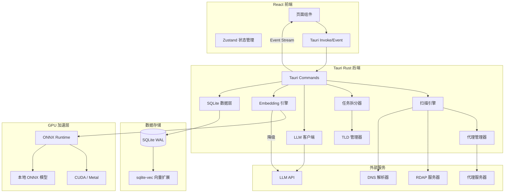

## 产品概述

基于 Tauri 框架的桌面域名扫描应用，支持 LLM/正则/通配符生成扫描列表，代理并发扫描未注册域名，任务断点续传，实时日志，结果导出，以及基于向量数据库（支持 GPU 加速）的二次语义筛选。

## 核心功能

- **扫描列表生成**：LLM API（OpenAI 兼容，预置 GLM/MiniMax/Zhipu 模板）生成候选域名，或正则/通配符/手动输入，自动组合所有 TLD 后缀
- **大规模任务拆分**：超大规模扫描（如四字母全字段 x 1500+ TLD 可达数十亿）自动按 TLD 分组拆分为子任务，子任务独立调度、并行执行、各自维护断点
- **并发域名扫描**：HTTP/HTTPS/SOCKS5 代理轮转，并发查询域名注册状态（RDAP + DNS 兜底），限流退避策略
- **任务管理与断点续传**：任务列表（进行中/暂停/完成），子任务进度独立追踪，暂停后从断点续传
- **流式处理**：扫描结果分批写入、前端分页加载、日志批量推送、导出流式写文件，全链路避免全量加载内存
- **实时日志**：扫描过程通过 Tauri event stream 实时推送，支持级别筛选和历史查看
- **结果导出**：JSON/TXT/CSV 格式，流式写文件支持大规模结果
- **二次筛选**：精确匹配/模糊匹配/正则匹配/LLM 语义筛选，语义筛选支持 GPU 加速本地 embedding 模型或远程 API 降级
- **GPU 加速向量化**：自动检测 CUDA/Metal，本地 ONNX 模型推理；GPU 不可用时降级为远程 embedding API 或 CPU 模式

## 技术栈

- **桌面框架**：Tauri 2.0（Rust 后端 + Web 前端）
- **前端**：React 18 + TypeScript + Vite 5 + TailwindCSS 3.4 + Zustand + react-window（虚拟滚动）+ recharts（图表）
- **Rust 后端**：tokio（异步并发）、reqwest（HTTP/代理）、rusqlite（SQLite）、serde、hickory-resolver（DNS）
- **域名查询**：RDAP 协议（reqwest 请求）+ hickory-resolver（DNS 兜底）
- **数据库**：SQLite（rusqlite，WAL 模式）+ sqlite-vec 向量扩展（零额外部署）
- **LLM**：OpenAI 兼容格式 API（chat + embedding），预置 GLM/MiniMax/Zhipu 配置
- **本地 Embedding/GPU**：ort（ONNX Runtime Rust binding，feature = "cuda"）+ 预置 all-MiniLM-L6-v2 ONNX 模型；GPU 不可用时降级为远程 API 或 CPU
- **TLD 数据**：ICANN 官方列表（内置约 1500+，可在线更新）

## 实现方案

### 系统架构



### 核心设计决策

**1. 大规模任务拆分机制**

- 用户创建任务时，系统估算扫描总量（如 4 字母 = 26^4 = 456976，x 1500 TLD ≈ 6.8 亿）
- 当扫描项超过阈值（默认 100 万），自动按 TLD 分组拆分为子任务
- 每个子任务处理一个或多个 TLD 的全量扫描，独立调度，可并行执行
- 子任务各自维护 `completed_index`，父任务汇总子任务进度
- 扫描项不预生成全量记录，而是流式生成（迭代器模式），按需生成当前批次域名列表

**2. 流式处理全链路**

- **扫描列表生成**：使用 Rust 迭代器/生成器模式，按批次生成域名（每批 5000），不预分配全量列表
- **扫描结果写入**：批量 INSERT 事务（每 500 条一批），减少 SQLite 事务开销
- **前端结果展示**：分页加载（SQL LIMIT/OFFSET，每页 100 条）
- **日志推送**：批量推送（每 200ms 或积累 100 条）
- **导出**：流式写文件（逐行/逐批写入），不全量加载到内存

**3. 断点续传**

- 每个子任务维护 `completed_index`（已扫描域名索引位置）
- 暂停时将进度写入 SQLite
- 恢复时从 `completed_index` 位置重新生成迭代器继续
- 任务状态机：Pending → Running ⇄ Paused → Completed

**4. 域名注册查询策略**

- 优先 RDAP（结构化返回、标准化接口），按 TLD 选择对应 RDAP 服务器
- DNS 解析兜底：无 DNS 记录则标记"可能未注册"
- 大规模扫描时 RDAP 可能限流：指数退避重试（1s/2s/4s/8s，最多 3 次），超限后自动降级为 DNS 查询
- 结果中记录查询方法（rdap/dns），便于判断可信度

**5. GPU 加速向量化**

- 启动时自动检测 GPU：CUDA（NVIDIA）/ Metal（macOS）/ 无
- 本地模型：all-MiniLM-L6-v2（384 维，~80MB ONNX 文件），首次使用时从内置资源释放到本地
- GPU 可用 → ort（ONNX Runtime）+ CUDA/Metal 后端，batch_size=500
- GPU 不可用 → 降级链：远程 LLM embedding API → CPU 本地推理
- 向量化分批处理，每批 500 条域名，显示独立进度条
- 向量维度可选 384/768/1536，适配不同 embedding 模型

**6. 并发控制**

- tokio::sync::Semaphore 控制最大并发数（默认 50，用户可调）
- 请求间随机延迟（可配置，默认 50-200ms）
- 代理轮转：Round-Robin 分配，失败自动切换

**7. LLM 集成**

- 统一 OpenAI 兼容格式，不同厂商只需配置 base_url + api_key + model
- 预定义模板：GLM（智谱）/ MiniMax / Zhipu 等
- 两种场景：chat completion（生成扫描列表 + 语义评分）、embedding（向量化）

### 数据库 Schema

```sql
-- 父任务表
CREATE TABLE tasks (
    id TEXT PRIMARY KEY,
    name TEXT NOT NULL,
    status TEXT NOT NULL DEFAULT 'pending',
    scan_mode TEXT NOT NULL,
    config_json TEXT NOT NULL,
    total_count INTEGER DEFAULT 0,
    completed_count INTEGER DEFAULT 0,
    is_split INTEGER DEFAULT 0,
    sub_task_count INTEGER DEFAULT 0,
    created_at DATETIME DEFAULT CURRENT_TIMESTAMP,
    updated_at DATETIME DEFAULT CURRENT_TIMESTAMP
);

-- 子任务表
CREATE TABLE sub_tasks (
    id TEXT PRIMARY KEY,
    parent_task_id TEXT NOT NULL REFERENCES tasks(id),
    name TEXT NOT NULL,
    status TEXT NOT NULL DEFAULT 'pending',
    tld_group TEXT,
    total_count INTEGER DEFAULT 0,
    completed_count INTEGER DEFAULT 0,
    completed_index INTEGER DEFAULT 0,
    created_at DATETIME DEFAULT CURRENT_TIMESTAMP,
    updated_at DATETIME DEFAULT CURRENT_TIMESTAMP
);

-- 扫描项表
CREATE TABLE scan_items (
    id INTEGER PRIMARY KEY AUTOINCREMENT,
    task_id TEXT NOT NULL REFERENCES tasks(id),
    sub_task_id TEXT REFERENCES sub_tasks(id),
    domain TEXT NOT NULL,
    tld TEXT NOT NULL,
    item_index INTEGER NOT NULL,
    status TEXT DEFAULT 'pending',
    is_available INTEGER,
    query_method TEXT,
    response_time_ms INTEGER,
    error_message TEXT,
    checked_at DATETIME,
    UNIQUE(task_id, domain)
);
CREATE INDEX idx_scan_items_task_status ON scan_items(task_id, status);
CREATE INDEX idx_scan_items_sub_task ON scan_items(sub_task_id, status);

-- 任务日志
CREATE TABLE task_logs (
    id INTEGER PRIMARY KEY AUTOINCREMENT,
    task_id TEXT NOT NULL REFERENCES tasks(id),
    sub_task_id TEXT REFERENCES sub_tasks(id),
    level TEXT NOT NULL DEFAULT 'info',
    message TEXT NOT NULL,
    created_at DATETIME DEFAULT CURRENT_TIMESTAMP
);
CREATE INDEX idx_task_logs_task ON task_logs(task_id, created_at DESC);

-- 代理配置
CREATE TABLE proxies (
    id INTEGER PRIMARY KEY AUTOINCREMENT,
    name TEXT,
    url TEXT NOT NULL,
    proxy_type TEXT NOT NULL,
    username TEXT,
    password TEXT,
    is_active INTEGER DEFAULT 1
);

-- LLM 配置
CREATE TABLE llm_configs (
    id TEXT PRIMARY KEY,
    name TEXT NOT NULL,
    base_url TEXT NOT NULL,
    api_key TEXT NOT NULL,
    model TEXT NOT NULL,
    embedding_model TEXT,
    embedding_dim INTEGER DEFAULT 384,
    is_default INTEGER DEFAULT 0
);

-- GPU 配置
CREATE TABLE gpu_configs (
    id INTEGER PRIMARY KEY DEFAULT 1,
    backend TEXT DEFAULT 'auto',
    device_id INTEGER DEFAULT 0,
    batch_size INTEGER DEFAULT 500,
    model_path TEXT
);

-- 筛选结果
CREATE TABLE filtered_results (
    id INTEGER PRIMARY KEY AUTOINCREMENT,
    task_id TEXT NOT NULL REFERENCES tasks(id),
    domain TEXT NOT NULL,
    filter_type TEXT NOT NULL,
    filter_pattern TEXT,
    is_matched INTEGER NOT NULL,
    score REAL,
    embedding_id INTEGER
);

-- sqlite-vec 虚拟表
CREATE VIRTUAL TABLE domain_vectors USING vec0(
    domain_id INTEGER PRIMARY KEY,
    domain_embedding float[384]
);
```

### 目录结构

```
domain-scanner-app/
├── src-tauri/
│   ├── Cargo.toml                      # Rust 依赖（含 ort/cuda feature 条件编译）
│   ├── tauri.conf.json
│   ├── build.rs
│   ├── capabilities/
│   │   └── default.json
│   ├── models/                         # 内置 ONNX 模型文件（all-MiniLM-L6-v2）
│   │   └── all-MiniLM-L6-v2.onnx
│   ├── src/
│   │   ├── main.rs
│   │   ├── lib.rs
│   │   ├── models/
│   │   │   ├── mod.rs
│   │   │   ├── task.rs                 # Task + SubTask 模型
│   │   │   ├── scan_item.rs
│   │   │   ├── proxy.rs
│   │   │   ├── llm.rs                 # LlmConfig + EmbeddingConfig
│   │   │   └── gpu.rs                 # GpuConfig + GpuBackend 枚举
│   │   ├── db/
│   │   │   ├── mod.rs
│   │   │   ├── init.rs                # 含 sub_tasks/domain_vectors/gpu_configs 建表
│   │   │   ├── task_repo.rs           # 含子任务 CRUD + 进度汇总
│   │   │   ├── scan_item_repo.rs      # 批量写入 + 分页查询 + 索引
│   │   │   ├── log_repo.rs            # 批量写入 + 分页查询
│   │   │   ├── filter_repo.rs
│   │   │   └── vector_repo.rs         # sqlite-vec 向量 CRUD + 相似度搜索
│   │   ├── commands/
│   │   │   ├── mod.rs
│   │   │   ├── task_cmds.rs           # 含子任务管理
│   │   │   ├── scan_cmds.rs
│   │   │   ├── export_cmds.rs         # 流式导出
│   │   │   ├── filter_cmds.rs         # 含语义筛选
│   │   │   ├── proxy_cmds.rs
│   │   │   ├── llm_cmds.rs
│   │   │   ├── log_cmds.rs            # 分页查询
│   │   │   ├── vector_cmds.rs         # 向量化 commands
│   │   │   └── gpu_cmds.rs            # GPU 检测/配置
│   │   ├── scanner/
│   │   │   ├── mod.rs
│   │   │   ├── engine.rs              # 子任务调度 + 大任务拆分
│   │   │   ├── domain_checker.rs      # RDAP + DNS + 限流退避
│   │   │   ├── tld_manager.rs
│   │   │   ├── list_generator.rs      # 流式生成（迭代器模式）
│   │   │   └── task_splitter.rs       # 大任务自动拆分器
│   │   ├── llm/
│   │   │   ├── mod.rs
│   │   │   ├── client.rs              # chat + embedding API
│   │   │   ├── providers.rs
│   │   │   └── prompts.rs
│   │   ├── embedding/
│   │   │   ├── mod.rs
│   │   │   ├── local_model.rs         # ONNX Runtime 本地推理
│   │   │   ├── remote_api.rs          # 远程 embedding API 降级
│   │   │   └── gpu_detector.rs        # GPU 检测与选择
│   │   ├── proxy/
│   │   │   ├── mod.rs
│   │   │   └── manager.rs
│   │   └── export/
│   │       ├── mod.rs
│   │       └── exporter.rs            # 流式写文件
├── src/
│   ├── main.tsx
│   ├── App.tsx
│   ├── vite-env.d.ts
│   ├── index.css                      # TailwindCSS 入口
│   ├── types/
│   │   └── index.ts                   # 含 SubTask, GpuConfig, VectorStatus
│   ├── services/
│   │   └── tauri.ts
│   ├── store/
│   │   ├── taskStore.ts               # 含子任务状态
│   │   ├── proxyStore.ts
│   │   ├── llmStore.ts
│   │   └── gpuStore.ts
│   ├── hooks/
│   │   ├── useTaskEvents.ts
│   │   ├── useTaskLogs.ts
│   │   ├── usePagination.ts
│   │   └── useVectorProgress.ts
│   ├── pages/
│   │   ├── Dashboard.tsx
│   │   ├── TaskList.tsx               # 含子任务展示
│   │   ├── TaskDetail.tsx             # 含子任务进度/分页结果
│   │   ├── NewTask.tsx                # 含扫描量预估 + 拆分预览
│   │   ├── FilterResults.tsx
│   │   ├── VectorizePage.tsx          # 向量化处理页
│   │   ├── ProxyManager.tsx
│   │   └── Settings.tsx               # 含 GPU 设置
│   └── components/
│       ├── Layout/
│       │   ├── AppLayout.tsx
│       │   └── Sidebar.tsx
│       ├── TaskList/
│       │   ├── TaskCard.tsx
│       │   ├── SubTaskList.tsx
│       │   └── TaskStatusBadge.tsx
│       ├── ScanConfig/
│       │   ├── LlmScanForm.tsx
│       │   ├── RegexScanForm.tsx       # 含扫描量预估
│       │   ├── ManualScanForm.tsx
│       │   └── TldSelector.tsx
│       ├── LogViewer/
│       │   └── LogViewer.tsx           # 虚拟滚动
│       ├── ResultExport/
│       │   └── ExportButton.tsx
│       ├── FilterPanel/
│       │   ├── ExactFilter.tsx
│       │   ├── FuzzyFilter.tsx
│       │   ├── RegexFilter.tsx
│       │   └── SemanticFilter.tsx
│       ├── Vectorize/
│       │   ├── VectorProgress.tsx
│       │   └── GpuStatus.tsx
│       └── Common/
│           ├── Pagination.tsx
│           └── VirtualList.tsx
├── package.json
├── vite.config.ts
├── tsconfig.json
├── tsconfig.app.json
├── tsconfig.node.json
├── tailwind.config.js
├── postcss.config.js
├── index.html
└── .gitignore
```

## 实现要点

### 性能考量

- **并发扫描**：Semaphore 控制上限（默认 50），请求间随机延迟 50-200ms
- **大规模扫描流式**：域名列表迭代器按批次生成（5000/批），结果批量写入（500/批事务），前端分页（100/页）
- **日志流控**：批量推送（200ms 或 100 条），避免事件队列过载
- **虚拟滚动**：日志和结果列表使用 react-window，避免大量 DOM 节点
- **SQLite 索引**：scan_items 按 (task_id, status) 和 (sub_task_id, status) 建索引，task_logs 按 (task_id, created_at DESC) 建索引
- **导出流式**：逐行/逐批写文件，不全量加载内存

### GPU 加速向量化

- 启动时 gpu_detector 检测可用后端（CUDA/Metal/CPU）
- 本地 ONNX 模型内置到二进制资源，首次使用释放到应用数据目录
- 分批 embedding（batch_size=500），避免显存溢出
- GPU 不可用时降级链：远程 embedding API → CPU 本地推理
- 向量化进度通过 Tauri event 实时推送

### 错误处理与可靠性

- RDAP/DNS 超时（默认 10s），超时标记 error，不阻塞
- RDAP 限流：指数退避重试（1s/2s/4s/8s，最多 3 次），超限降级 DNS
- 代理连接失败自动切换
- LLM API 失败降级为纯本地模式
- SQLite WAL 模式 + 批量事务

### 一次性安装

- Rust 依赖 Cargo.toml 声明，ort 的 cuda feature 通过条件编译（cfg feature）启用
- Node.js 依赖 package.json 声明
- sqlite-vec 编译为 Rust 侧 SQLite 扩展
- ONNX 模型文件内置到二进制资源或首次使用时下载

## 设计风格

深色科技风（Dark Cyberpunk）设计，契合域名扫描工具的专业技术定位。深色背景（#0D1117）搭配青绿色（#00E5A0）/青蓝色（#00C9DB）/蓝色（#0A84FF）霓虹强调色，营造专业且现代的工具感。玻璃拟态（Glassmorphism）面板，半透明卡片配合模糊背景，层次分明。微交互动画增强操作反馈。

## 页面规划（8 页）

### 1. 仪表盘（Dashboard）

- **顶部统计栏**：运行中/已完成/可用域名/代理状态 四格统计卡片，带渐变背景和图标
- **最近任务列表**：最近 5 个任务卡片，显示名称/状态/进度条/操作按钮
- **快捷操作区**：新建扫描/管理代理/向量化处理 快捷入口

### 2. 任务列表（TaskList）

- **筛选工具栏**：状态 Tab（全部/进行中/暂停/完成）+ 搜索框
- **任务卡片网格**：任务名/扫描模式/进度/状态/子任务数/操作按钮
- **批量操作栏**：全选 + 批量删除/导出

### 3. 新建任务（NewTask）

- **模式选择**：LLM/正则通配符/手动输入 Tab
- **扫描量预估**：实时计算并显示预计扫描量，超阈值提示自动拆分
- **配置表单**：按模式动态展示 + TLD 选择 + 代理/并发配置
- **预览与提交**：预估域名数量 + 拆分预览 + 开始按钮

### 4. 任务详情（TaskDetail）

- **进度头部**：环形进度图 + 统计数据（总数/已查/可用/不可用/错误）
- **子任务列表**：子任务卡片，各自显示进度和状态
- **结果表格**：分页加载，域名/TLD/状态/查询方法/响应时间
- **实时日志**：底部可折叠面板，虚拟滚动 + 级别筛选
- **操作工具栏**：暂停/继续/导出/向量化

### 5. 二次筛选（FilterResults）

- **筛选模式 Tab**：精确/模糊/正则/语义
- **语义筛选输入**：文本描述 + GPU/远程 API 选择 + 相似度阈值滑块
- **结果表格**：域名/匹配分数/匹配方式，分页加载
- **批量操作**：导出/重新筛选

### 6. 向量化处理（VectorizePage）

- **源任务选择**：选择要向量化的任务结果
- **GPU 状态指示**：当前后端（CUDA/Metal/CPU/Remote）+ 显存使用
- **向量化进度**：进度条 + 已处理/总数 + 预估剩余时间
- **批量操作**：开始/暂停/取消向量化

### 7. 代理管理（ProxyManager）

- **代理列表**：CRUD 表格，支持批量导入
- **连接测试**：单条/批量测试，延迟显示
- **代理状态**：活跃/不可用 标签

### 8. 设置（Settings）

- **LLM 配置**：预定义厂商快速添加 + 自定义配置 + 连接测试
- **GPU 设置**：后端选择/设备 ID/batch_size/本地模型路径
- **TLD 管理**：当前列表 + 在线更新
- **通用设置**：默认并发数/超时/日志级别/扫描量阈值

## Agent Extensions

### Skill

- **frontend-design**
- Purpose: 创建高质量的前端 UI 界面，包括仪表盘、任务列表、扫描配置、日志查看器、筛选面板、向量化处理页等全部核心页面
- Expected outcome: 生成具有深色科技风格、玻璃拟态效果的专业级 React + TailwindCSS 组件代码

### SubAgent

- **code-explorer**
- Purpose: 在实现过程中快速搜索和验证 Rust crate API、Tauri command 注册模式、sqlite-vec 集成方式等跨文件依赖关系
- Expected outcome: 准确定位模块间的调用链和数据流，确保实现一致性