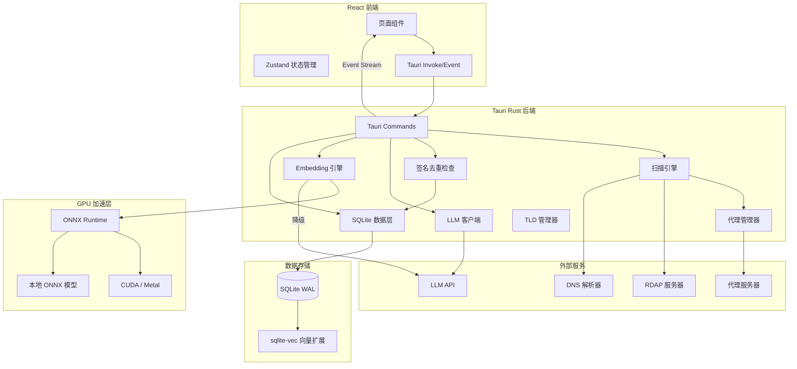

## 产品概述

基于 Tauri 框架的桌面域名扫描应用，支持 LLM/正则/通配符生成扫描列表，代理并发扫描未注册域名，任务断点续传，实时日志，结果导出，以及基于向量数据库（支持 GPU 加速）的二次语义筛选。

## 核心功能

- **扫描列表生成**：LLM API（OpenAI 兼容，预置 GLM/MiniMax/Zhipu 模板）生成候选域名，或正则/通配符/手动输入
- **原子任务模型**：一个任务 = n 个前缀 x 1 个 TLD 后缀，不可再拆；多 TLD 需并行创建多个独立任务
- **任务签名去重**：基于「前缀模式 + TLD」生成唯一签名，防止同一组合被重复扫描
- **批次管理**：同一次创建的多 TLD 任务归为同一批次，支持批次级操作（批量暂停/继续/导出）
- **并发域名扫描**：HTTP/HTTPS/SOCKS5 代理轮转，并发查询域名注册状态（RDAP + DNS 兜底），限流退避
- **任务管理与断点续传**：任务列表（进行中/暂停/完成），completed_index 追踪进度，暂停后从断点续传
- **流式处理**：域名迭代器按批生成、扫描结果批量写入、前端分页加载、日志批量推送、导出流式写文件
- **实时日志**：扫描过程通过 Tauri event stream 实时推送，支持级别筛选和历史查看
- **结果导出**：JSON/TXT/CSV 格式，流式写文件
- **二次筛选**：精确匹配/模糊匹配/正则匹配/LLM 语义筛选，语义筛选支持 GPU 加速 embedding
- **GPU 加速向量化**：自动检测 CUDA/Metal，本地 ONNX 模型推理；降级为远程 API 或 CPU 模式

## 技术栈

- **桌面框架**：Tauri 2.0（Rust 后端 + Web 前端）
- **前端**：React 18 + TypeScript + Vite 5 + TailwindCSS 3.4 + Zustand + react-window + recharts
- **Rust 后端**：tokio、reqwest、rusqlite、serde、hickory-resolver
- **域名查询**：RDAP（reqwest）+ hickory-resolver（DNS 兜底）
- **数据库**：SQLite（rusqlite，WAL 模式）+ sqlite-vec 向量扩展
- **LLM**：OpenAI 兼容格式 API（chat + embedding），预置 GLM/MiniMax/Zhipu
- **本地 Embedding/GPU**：ort（ONNX Runtime Rust binding，cuda feature 条件编译）+ all-MiniLM-L6-v2 模型
- **TLD 数据**：ICANN 官方列表（内置 1500+，可在线更新）

## 实现方案

### 系统架构



### 核心设计决策

**1. 原子任务模型（1 任务 = n 前缀 x 1 TLD）**

- 一个任务只扫描一个 TLD 后缀，不可再拆分
- 多 TLD 扫描 → 为每个 TLD 创建独立任务，并行执行
- 每个任务维护自己的 `completed_index`，独立断点续传
- 流式生成域名：使用 Rust 迭代器模式，按批次生成（5000/批），不预分配全量列表
- 创建时实时预估扫描量（如 4 字母 = 26^4 = 456,976 项/任务）

**2. 任务签名去重**

- 每个任务基于「前缀模式 + TLD」生成唯一签名（SHA-256 hash）
- 签名规则：
- 正则/通配符：`regex:{pattern}:tld:{tld}` → SHA-256
- LLM：`llm:{config_id}:{prompt_hash}:tld:{tld}` → SHA-256
- 手动列表：`manual:{domains_hash}:tld:{tld}` → SHA-256
- 创建任务前检查 signature 是否已存在（tasks 表 UNIQUE 约束）
- 同一签名已有 Running/Paused/Completed 任务时阻止创建（除非用户强制覆盖）
- NewTask 页面：创建时逐个检查签名，报告"创建 N 个，跳过 M 个已存在"

**3. 批次管理**

- 同一次从 NewTask 页面创建的一组任务属于同一 batch（共享 batch_id）
- 批次支持：批量暂停/继续/导出
- 任务列表支持按批次分组展示
- 批次元数据：batch_id、name、task_count、created_at

**4. 流式处理全链路**

- 域名列表：Rust 迭代器按批次生成（5000/批）
- 扫描结果：批量 INSERT 事务（500/批）
- 前端结果：分页加载（SQL LIMIT/OFFSET，100/页）
- 日志推送：批量推送（200ms 或 100 条）
- 导出：流式写文件，不全量加载

**5. 断点续传**

- 每个任务维护 `completed_index`（已扫描域名索引位置）
- 暂停时进度写入 SQLite
- 恢复时从 `completed_index` 位置重新生成迭代器继续
- 状态机：Pending → Running ⇄ Paused → Completed

**6. 域名注册查询策略**

- 优先 RDAP，按 TLD 选择对应 RDAP 服务器
- DNS 解析兜底：无 DNS 记录标记"可能未注册"
- 大规模扫描限流退避：指数退避（1s/2s/4s/8s，最多 3 次），超限降级 DNS
- 结果记录查询方法（rdap/dns）

**7. GPU 加速向量化**

- 启动时自动检测 GPU：CUDA（NVIDIA）/ Metal（macOS）/ 无
- 本地模型：all-MiniLM-L6-v2（384 维），内置资源释放到应用数据目录
- GPU 可用 → ort + CUDA/Metal，batch_size=500
- 降级链：远程 LLM embedding API → CPU 本地推理
- 分批处理，独立进度条

**8. 并发控制**

- tokio::sync::Semaphore 控制最大并发（默认 50，可调）
- 请求间随机延迟（50-200ms，可配置）
- 代理 Round-Robin 轮转，失败自动切换

### 数据库 Schema

```sql
-- 任务表（原子任务：1 TLD）
CREATE TABLE tasks (
    id TEXT PRIMARY KEY,
    batch_id TEXT REFERENCES task_batches(id),
    name TEXT NOT NULL,
    signature TEXT NOT NULL UNIQUE,
    status TEXT NOT NULL DEFAULT 'pending',
    scan_mode TEXT NOT NULL,
    config_json TEXT NOT NULL,
    tld TEXT NOT NULL,
    prefix_pattern TEXT,
    total_count INTEGER DEFAULT 0,
    completed_count INTEGER DEFAULT 0,
    completed_index INTEGER DEFAULT 0,
    available_count INTEGER DEFAULT 0,
    error_count INTEGER DEFAULT 0,
    created_at DATETIME DEFAULT CURRENT_TIMESTAMP,
    updated_at DATETIME DEFAULT CURRENT_TIMESTAMP
);
CREATE UNIQUE INDEX idx_tasks_signature ON tasks(signature);
CREATE INDEX idx_tasks_batch ON tasks(batch_id);
CREATE INDEX idx_tasks_status ON tasks(status);

-- 批次表
CREATE TABLE task_batches (
    id TEXT PRIMARY KEY,
    name TEXT NOT NULL,
    task_count INTEGER DEFAULT 0,
    created_at DATETIME DEFAULT CURRENT_TIMESTAMP
);

-- 扫描项表
CREATE TABLE scan_items (
    id INTEGER PRIMARY KEY AUTOINCREMENT,
    task_id TEXT NOT NULL REFERENCES tasks(id),
    domain TEXT NOT NULL,
    tld TEXT NOT NULL,
    item_index INTEGER NOT NULL,
    status TEXT DEFAULT 'pending',
    is_available INTEGER,
    query_method TEXT,
    response_time_ms INTEGER,
    error_message TEXT,
    checked_at DATETIME,
    UNIQUE(task_id, domain)
);
CREATE INDEX idx_scan_items_task_status ON scan_items(task_id, status);

-- 任务日志
CREATE TABLE task_logs (
    id INTEGER PRIMARY KEY AUTOINCREMENT,
    task_id TEXT NOT NULL REFERENCES tasks(id),
    level TEXT NOT NULL DEFAULT 'info',
    message TEXT NOT NULL,
    created_at DATETIME DEFAULT CURRENT_TIMESTAMP
);
CREATE INDEX idx_task_logs_task ON task_logs(task_id, created_at DESC);

-- 代理配置
CREATE TABLE proxies (
    id INTEGER PRIMARY KEY AUTOINCREMENT,
    name TEXT,
    url TEXT NOT NULL,
    proxy_type TEXT NOT NULL,
    username TEXT,
    password TEXT,
    is_active INTEGER DEFAULT 1
);

-- LLM 配置
CREATE TABLE llm_configs (
    id TEXT PRIMARY KEY,
    name TEXT NOT NULL,
    base_url TEXT NOT NULL,
    api_key TEXT NOT NULL,
    model TEXT NOT NULL,
    embedding_model TEXT,
    embedding_dim INTEGER DEFAULT 384,
    is_default INTEGER DEFAULT 0
);

-- GPU 配置
CREATE TABLE gpu_configs (
    id INTEGER PRIMARY KEY DEFAULT 1,
    backend TEXT DEFAULT 'auto',
    device_id INTEGER DEFAULT 0,
    batch_size INTEGER DEFAULT 500,
    model_path TEXT
);

-- 筛选结果
CREATE TABLE filtered_results (
    id INTEGER PRIMARY KEY AUTOINCREMENT,
    task_id TEXT NOT NULL REFERENCES tasks(id),
    domain TEXT NOT NULL,
    filter_type TEXT NOT NULL,
    filter_pattern TEXT,
    is_matched INTEGER NOT NULL,
    score REAL,
    embedding_id INTEGER
);

-- sqlite-vec 向量虚拟表
CREATE VIRTUAL TABLE domain_vectors USING vec0(
    domain_id INTEGER PRIMARY KEY,
    domain_embedding float[384]
);
```

### 目录结构

```
domain-scanner-app/
├── src-tauri/
│   ├── Cargo.toml                      # [NEW] Rust 依赖（ort/cuda feature 条件编译）
│   ├── tauri.conf.json                 # [NEW] Tauri 应用配置
│   ├── build.rs                        # [NEW] 构建脚本
│   ├── capabilities/
│   │   └── default.json                # [NEW] Tauri 2.0 权限
│   ├── models/
│   │   └── all-MiniLM-L6-v2.onnx      # [NEW] 内置 embedding 模型
│   ├── src/
│   │   ├── main.rs                     # [NEW] 入口
│   │   ├── lib.rs                      # [NEW] 模块声明 + command 注册
│   │   ├── models/
│   │   │   ├── mod.rs                  # [NEW]
│   │   │   ├── task.rs                 # [NEW] Task + TaskBatch + TaskSignature
│   │   │   ├── scan_item.rs            # [NEW] ScanItem + ScanStatus
│   │   │   ├── proxy.rs                # [NEW] ProxyConfig + ProxyType
│   │   │   ├── llm.rs                  # [NEW] LlmConfig + EmbeddingConfig
│   │   │   └── gpu.rs                  # [NEW] GpuConfig + GpuBackend
│   │   ├── db/
│   │   │   ├── mod.rs                  # [NEW]
│   │   │   ├── init.rs                 # [NEW] 建表迁移（含 task_batches/signature 唯一索引）
│   │   │   ├── task_repo.rs            # [NEW] 任务 CRUD + 签名去重 + 进度更新
│   │   │   ├── batch_repo.rs           # [NEW] 批次 CRUD + 批次级操作
│   │   │   ├── scan_item_repo.rs       # [NEW] 批量写入 + 分页查询
│   │   │   ├── log_repo.rs             # [NEW] 批量写入 + 分页查询
│   │   │   ├── filter_repo.rs          # [NEW] 筛选结果 CRUD
│   │   │   └── vector_repo.rs          # [NEW] sqlite-vec 向量 CRUD + 相似度搜索
│   │   ├── commands/
│   │   │   ├── mod.rs                  # [NEW]
│   │   │   ├── task_cmds.rs            # [NEW] 任务管理（创建含签名去重+批量创建）
│   │   │   ├── batch_cmds.rs           # [NEW] 批次管理 commands
│   │   │   ├── scan_cmds.rs            # [NEW] 扫描配置/预览
│   │   │   ├── export_cmds.rs          # [NEW] 流式导出
│   │   │   ├── filter_cmds.rs          # [NEW] 筛选（含语义）
│   │   │   ├── proxy_cmds.rs           # [NEW] 代理 CRUD
│   │   │   ├── llm_cmds.rs             # [NEW] LLM 配置 CRUD + 测试
│   │   │   ├── log_cmds.rs             # [NEW] 日志分页查询
│   │   │   ├── vector_cmds.rs          # [NEW] 向量化 commands
│   │   │   └── gpu_cmds.rs             # [NEW] GPU 检测/配置
│   │   ├── scanner/
│   │   │   ├── mod.rs                  # [NEW]
│   │   │   ├── engine.rs               # [NEW] 单任务扫描引擎（并发+断点+进度推送）
│   │   │   ├── domain_checker.rs       # [NEW] RDAP + DNS + 限流退避
│   │   │   ├── tld_manager.rs          # [NEW] TLD 列表管理
│   │   │   ├── list_generator.rs       # [NEW] 流式域名迭代器
│   │   │   └── signature.rs            # [NEW] 任务签名生成 + 去重检查
│   │   ├── llm/
│   │   │   ├── mod.rs                  # [NEW]
│   │   │   ├── client.rs               # [NEW] OpenAI 兼容客户端（chat+embedding）
│   │   │   ├── providers.rs            # [NEW] 预定义厂商（GLM/MiniMax/Zhipu）
│   │   │   └── prompts.rs              # [NEW] Prompt 模板
│   │   ├── embedding/
│   │   │   ├── mod.rs                  # [NEW]
│   │   │   ├── local_model.rs          # [NEW] ONNX Runtime 本地推理
│   │   │   ├── remote_api.rs           # [NEW] 远程 embedding API 降级
│   │   │   └── gpu_detector.rs         # [NEW] GPU 检测与选择
│   │   ├── proxy/
│   │   │   ├── mod.rs                  # [NEW]
│   │   │   └── manager.rs              # [NEW] 代理轮转+健康检查
│   │   └── export/
│   │       ├── mod.rs                  # [NEW]
│   │       └── exporter.rs             # [NEW] 流式导出（JSON/CSV/TXT）
├── src/
│   ├── main.tsx                        # [NEW] React 入口
│   ├── App.tsx                         # [NEW] 根组件 + 路由
│   ├── vite-env.d.ts                   # [NEW] Vite 类型
│   ├── index.css                       # [NEW] TailwindCSS 入口
│   ├── types/
│   │   └── index.ts                    # [NEW] 全部类型（含 TaskBatch, TaskSignature, GpuConfig）
│   ├── services/
│   │   └── tauri.ts                    # [NEW] Tauri invoke/listen 封装
│   ├── store/
│   │   ├── taskStore.ts                # [NEW] 任务+批次状态
│   │   ├── batchStore.ts               # [NEW] 批次状态管理
│   │   ├── proxyStore.ts               # [NEW] 代理状态
│   │   ├── llmStore.ts                 # [NEW] LLM 配置状态
│   │   └── gpuStore.ts                 # [NEW] GPU 状态
│   ├── hooks/
│   │   ├── useTaskEvents.ts            # [NEW] Tauri event 监听
│   │   ├── useTaskLogs.ts              # [NEW] 实时日志 hook
│   │   ├── usePagination.ts            # [NEW] 分页 hook
│   │   └── useVectorProgress.ts        # [NEW] 向量化进度 hook
│   ├── pages/
│   │   ├── Dashboard.tsx               # [NEW] 仪表盘
│   │   ├── TaskList.tsx                # [NEW] 任务列表（按批次分组）
│   │   ├── TaskDetail.tsx              # [NEW] 任务详情（单任务进度+结果+日志）
│   │   ├── NewTask.tsx                 # [NEW] 新建任务（多TLD→批量创建+去重）
│   │   ├── FilterResults.tsx           # [NEW] 二次筛选
│   │   ├── VectorizePage.tsx           # [NEW] 向量化处理
│   │   ├── ProxyManager.tsx            # [NEW] 代理管理
│   │   └── Settings.tsx                # [NEW] 设置（LLM/GPU/TLD/通用）
│   └── components/
│       ├── Layout/
│       │   ├── AppLayout.tsx           # [NEW] 应用布局（侧边栏+内容区）
│       │   └── Sidebar.tsx             # [NEW] 侧边导航
│       ├── TaskList/
│       │   ├── TaskCard.tsx            # [NEW] 任务卡片（状态+进度条+TLD标签）
│       │   ├── BatchGroup.tsx          # [NEW] 批次分组组件
│       │   └── TaskStatusBadge.tsx     # [NEW] 状态标签
│       ├── ScanConfig/
│       │   ├── LlmScanForm.tsx         # [NEW] LLM 扫描配置
│       │   ├── RegexScanForm.tsx       # [NEW] 正则/通配符配置（含扫描量预估）
│       │   ├── ManualScanForm.tsx      # [NEW] 手动列表输入
│       │   └── TldSelector.tsx         # [NEW] TLD 多选器（显示每个TLD预估量）
│       ├── LogViewer/
│       │   └── LogViewer.tsx           # [NEW] 实时日志（虚拟滚动+级别筛选）
│       ├── ResultExport/
│       │   └── ExportButton.tsx        # [NEW] 导出按钮（JSON/CSV/TXT）
│       ├── FilterPanel/
│       │   ├── ExactFilter.tsx         # [NEW] 精确匹配
│       │   ├── FuzzyFilter.tsx         # [NEW] 模糊匹配
│       │   ├── RegexFilter.tsx         # [NEW] 正则匹配
│       │   └── SemanticFilter.tsx      # [NEW] LLM 语义筛选
│       ├── Vectorize/
│       │   ├── VectorProgress.tsx      # [NEW] 向量化进度
│       │   └── GpuStatus.tsx           # [NEW] GPU 状态指示器
│       └── Common/
│           ├── Pagination.tsx          # [NEW] 分页组件
│           └── VirtualList.tsx         # [NEW] 虚拟列表组件
├── package.json                        # [NEW] Node.js 依赖
├── vite.config.ts                      # [NEW] Vite 配置
├── tsconfig.json                       # [NEW] TypeScript 配置
├── tsconfig.app.json                   # [NEW] App TypeScript 配置
├── tsconfig.node.json                  # [NEW] Node TypeScript 配置
├── tailwind.config.js                  # [NEW] TailwindCSS 配置
├── postcss.config.js                   # [NEW] PostCSS 配置
├── index.html                          # [NEW] HTML 入口
└── .gitignore                          # [NEW] Git 忽略
```

## 实现要点

### 性能考量

- **并发扫描**：Semaphore 控制上限（默认 50），请求间随机延迟 50-200ms
- **流式生成**：域名迭代器按批生成（5000/批），结果批量写入（500/批事务），前端分页（100/页）
- **日志流控**：批量推送（200ms 或 100 条）
- **虚拟滚动**：react-window 避免大量 DOM 节点
- **SQLite 索引**：tasks(signature) UNIQUE、tasks(batch_id)、tasks(status)、scan_items(task_id, status)、task_logs(task_id, created_at DESC)
- **导出流式**：逐行/逐批写文件

### GPU 加速向量化

- 启动时 gpu_detector 检测 CUDA/Metal/CPU
- ONNX 模型内置到二进制资源，首次使用释放到应用数据目录
- 分批 embedding（batch_size=500），避免显存溢出
- 降级链：远程 embedding API → CPU 本地推理
- 向量化进度通过 Tauri event 实时推送

### 错误处理与可靠性

- RDAP/DNS 超时（10s），超时标记 error，不阻塞
- RDAP 限流：指数退避重试（1s/2s/4s/8s，3 次），超限降级 DNS
- 代理连接失败自动切换
- LLM API 失败降级为纯本地模式
- SQLite WAL 模式 + 批量事务

### 一次性安装

- Rust 依赖 Cargo.toml 声明，ort cuda feature 条件编译
- Node.js 依赖 package.json 声明
- sqlite-vec 编译为 Rust 侧 SQLite 扩展
- ONNX 模型文件内置或首次下载

## 设计风格

采用深色科技风（Dark Cyberpunk）设计，契合域名扫描工具的专业技术定位。深色背景搭配青绿色/青蓝色霓虹强调色，玻璃拟态面板，半透明卡片配合模糊背景，层次分明。微交互动画增强操作反馈。

## 页面规划（8 页）

### 1. 仪表盘（Dashboard）

- **顶部统计栏**：运行中/已完成/可用域名/代理状态 四格统计卡片，渐变背景+图标
- **最近任务列表**：最近 5 个任务卡片，名称/状态/进度条/操作
- **快捷操作区**：新建扫描/管理代理/向量化处理 入口

### 2. 任务列表（TaskList）

- **筛选工具栏**：状态 Tab + 搜索框
- **按批次分组展示**：批次折叠组，每个任务卡片显示名称/TLD/前缀模式/状态/进度/操作
- **批次级操作**：全部暂停/继续/批量导出
- **批量操作**：全选 + 批量删除/导出

### 3. 新建任务（NewTask）

- **模式选择**：LLM/正则通配符/手动输入 Tab
- **扫描量预估**：实时计算，每个 TLD 独立预估（如".com: 456,976 项"）
- **TLD 多选器**：选择多个 TLD，每个显示预估量，总计显示
- **去重检查结果**：创建后显示"创建了 N 个新任务，跳过了 M 个已存在组合"
- **配置表单**：按模式动态展示 + 代理/并发配置

### 4. 任务详情（TaskDetail）

- **进度头部**：环形进度图 + 统计（总数/已查/可用/不可用/错误）
- **结果表格**：分页加载，域名/TLD/状态/查询方法/响应时间
- **实时日志**：底部可折叠面板，虚拟滚动+级别筛选
- **操作工具栏**：暂停/继续/导出/向量化

### 5. 二次筛选（FilterResults）

- **筛选模式 Tab**：精确/模糊/正则/语义
- **语义筛选**：文本描述 + GPU/远程选择 + 相似度阈值滑块
- **结果表格**：域名/匹配分数/匹配方式，分页加载

### 6. 向量化处理（VectorizePage）

- **源任务选择**：选择要向量化的任务
- **GPU 状态指示**：当前后端 + 显存使用
- **向量化进度**：进度条 + 已处理/总数 + 预估时间

### 7. 代理管理（ProxyManager）

- **代理列表**：CRUD 表格，批量导入
- **连接测试**：延迟显示
- **代理状态**：活跃/不可用标签

### 8. 设置（Settings）

- **LLM 配置**：预定义厂商快速添加 + 自定义 + 连接测试
- **GPU 设置**：后端选择/设备 ID/batch_size/模型路径
- **TLD 管理**：列表 + 在线更新
- **通用设置**：默认并发/超时/日志级别

## Skill

- **frontend-design**
- Purpose: 创建高质量前端 UI 界面，包括仪表盘、任务列表、扫描配置、日志查看器、筛选面板、向量化处理页等全部 8 个核心页面
- Expected outcome: 生成具有深色科技风格、玻璃拟态效果的专业级 React + TailwindCSS 组件代码

## SubAgent

- **code-explorer**
- Purpose: 在实现过程中快速搜索验证 Rust crate API、Tauri command 注册模式、sqlite-vec 集成方式等跨文件依赖关系
- Expected outcome: 准确定位模块间调用链和数据流，确保实现一致性