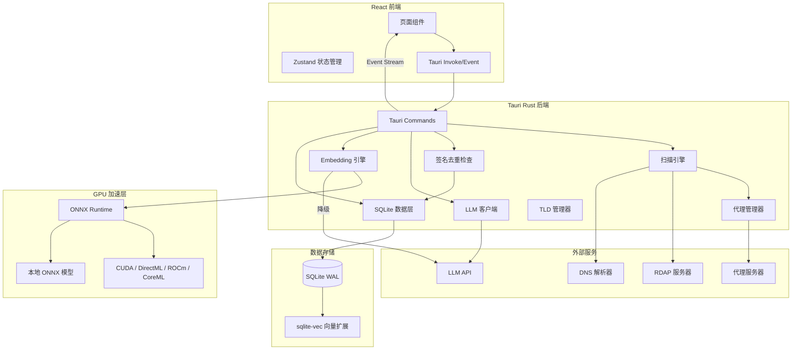

## 产品概述

基于 Tauri 框架的桌面域名扫描应用，支持 LLM/正则/通配符生成扫描列表，代理并发扫描未注册域名，任务断点续传，实时日志，结果导出，基于向量数据库（支持 GPU 加速）的二次语义筛选。采用 TDD 开发模式，单元测试与集成测试全覆盖。

## 核心功能

- **扫描列表生成**：LLM API（OpenAI 兼容，预置 GLM/MiniMax/Zhipu 模板）生成候选域名，或正则/通配符/手动输入
- **原子任务模型**：一个任务 = n 个前缀 × 1 个 TLD 后缀，不可再拆；多 TLD 需并行创建多个独立任务
- **任务签名去重**：基于「前缀模式 + TLD」生成唯一 SHA-256 签名，防止同一组合被重复扫描
- **批次管理**：同一次创建的多 TLD 任务归为同一批次，支持批次级操作（批量暂停/继续/导出）
- **并发域名扫描**：HTTP/HTTPS/SOCKS5 代理轮转，并发查询域名注册状态（RDAP + DNS 兜底），限流退避
- **任务管理与断点续传**：任务列表（进行中/暂停/完成），completed_index 追踪进度，暂停后从断点续传
- **流式处理**：域名迭代器按批生成、扫描结果批量写入、前端分页加载、日志批量推送、导出流式写文件
- **实时日志**：扫描过程通过 Tauri event stream 实时推送，支持级别筛选和历史查看
- **结果导出**：JSON/TXT/CSV 格式，流式写文件
- **二次筛选**：精确匹配/模糊匹配/正则匹配/LLM 语义筛选，语义筛选支持 GPU 加速 embedding
- **GPU 加速向量化**：自动检测 CUDA(NVIDIA)/DirectML(AMD+Windows)/ROCm(AMD+Linux)/CoreML(Apple Silicon)，本地 ONNX 模型推理；降级为远程 API 或 CPU 模式
- **TDD 全覆盖**：Rust 单元测试（内联）+ Rust 集成测试 + 前端单元测试（Vitest）+ 前端 E2E 测试
- **Git 版本管理**：每个 task 完成后自动 git add + commit，commit message 格式为 `feat: <task描述>`，便于追溯和回退

## Tech Stack

### 桌面框架

- Tauri 2.0（Rust 后端 + Web 前端）

### 前端

- React 18 + TypeScript + Vite 5
- TailwindCSS 3.4.17 + tailwind-merge ^2.5.5 + tailwindcss-animate ^1.0.7
- Zustand（状态管理）
- react-window（虚拟滚动）
- recharts（图表）
- lucide-react + react-icons（图标）
- PostCSS 8.5 + autoprefixer ^10.4.20

### Rust 后端

- tokio（异步并发）
- reqwest（HTTP/HTTPS/SOCKS5 代理请求）
- rusqlite（SQLite，WAL 模式）
- serde + serde_json（序列化）
- hickory-resolver（DNS 解析）
- sha2（签名哈希）
- ort（ONNX Runtime Rust binding，cuda/directml/rocm/coreml feature 条件编译）
- uuid（ID 生成）

### 数据库

- SQLite（rusqlite，WAL 模式）
- sqlite-vec（向量扩展，零额外部署）

### 域名查询

- RDAP 协议（reqwest 请求）+ hickory-resolver（DNS 兜底）

### LLM

- OpenAI 兼容格式 API（chat + embedding），预置 GLM/MiniMax/Zhipu

### 本地 Embedding/GPU

- ort（ONNX Runtime Rust binding，多后端 feature 条件编译）
- `gpu-cuda`：NVIDIA GPU（需预装 CUDA Toolkit）
- `gpu-directml`：AMD/Intel/NVIDIA GPU（Windows，零额外安装，DirectX 12 自带）
- `gpu-rocm`：AMD GPU（Linux，需预装 ROCm 6.0+）
- `gpu-coreml`：Apple Silicon（macOS，零额外安装）
- `gpu-auto`：运行时自动检测最佳后端
- all-MiniLM-L6-v2 ONNX 模型（384 维，~80MB）

### GPU 检测降级链

```
启动时检测 GPU 类型与可用后端：
├── NVIDIA GPU + CUDA 可用 → CUDA 后端（gpu-cuda feature）
├── AMD GPU + Windows → DirectML 后端（gpu-directml feature，零额外安装）
├── AMD GPU + Linux + ROCm → ROCm 后端（gpu-rocm feature，需预装 ROCm 6.0+）
├── Apple Silicon + macOS → CoreML 后端（gpu-coreml feature）
├── 有 GPU 但无编译支持 → 降级为远程 LLM embedding API
└── 无 GPU → CPU 本地推理（慢但可用）
```

### GPU 后端对比

| 后端 | Feature Flag | 平台 | 支持的 GPU | 额外依赖 |
| --- | --- | --- | --- | --- |
| CUDA | `gpu-cuda` | Windows/Linux | NVIDIA | 需预装 CUDA Toolkit + cuDNN |
| DirectML | `gpu-directml` | Windows | AMD/Intel/NVIDIA | 无（Windows 自带 DirectX 12） |
| ROCm | `gpu-rocm` | Linux | AMD | 需预装 ROCm 6.0+ |
| CoreML | `gpu-coreml` | macOS | Apple Silicon | 无（系统自带） |


### TLD 数据

- ICANN 官方列表（内置 1500+，可在线更新）

### 测试框架

- **Rust 单元测试**：`#[cfg(test)]` 内联 + `tokio::test` + `tempfile`（临时 DB）+ `mockito`（HTTP mock）
- **Rust 集成测试**：`tests/` 目录
- **前端单元测试**：Vitest + @testing-library/react + @testing-library/user-event + msw（mock Tauri API）

## Implementation Approach

### TDD 开发流程

每个功能模块严格按照「先写测试 → 实现 → 测试通过」的 TDD 循环：

1. 定义接口/类型（models）
2. 编写失败的测试用例
3. 实现最小代码使测试通过
4. 重构优化，确保测试仍然通过

### 原子任务模型

一个任务 = n 个前缀 × 1 个 TLD，不可再拆。多 TLD 需创建多个独立任务并行执行。每个任务维护自己的 completed_index 实现断点续传。域名列表使用 Rust 迭代器模式流式生成（5000/批），不预分配全量内存。

### 任务签名去重

基于「前缀模式 + TLD」生成唯一 SHA-256 签名，数据库 UNIQUE 约束保证不重复。创建任务前检查签名存在性，报告"创建 N 个，跳过 M 个已存在"。

### 流式处理全链路

域名迭代器按批生成（5000/批）→ 扫描结果批量 INSERT（500/批事务）→ 前端分页查询（100/页）→ 日志批量推送（200ms 或 100 条）→ 导出流式写文件。

### GPU 加速向量化

启动时检测 GPU 类型和可用后端（CUDA/DirectML/ROCm/CoreML）。本地 ONNX 模型（all-MiniLM-L6-v2）推理，分批处理（batch_size=500）。降级链：NVIDIA CUDA → AMD DirectML(Windows)/ROCm(Linux) → Apple CoreML → 远程 embedding API → CPU 本地。

Cargo.toml 条件编译设计：

```
[features]
default = []
gpu-cuda = ["ort/cuda"]
gpu-directml = ["ort/directml"]
gpu-rocm = ["ort/rocm"]
gpu-coreml = ["ort/coreml"]
gpu-auto = []  # 运行时自动检测
```

### 并发控制

tokio::sync::Semaphore 控制最大并发（默认 50，可调），请求间随机延迟 50-200ms，代理 Round-Robin 轮转，失败自动切换。RDAP 限流时指数退避重试（1s/2s/4s/8s，最多 3 次），超限降级 DNS。

## Implementation Notes

- SQLite WAL 模式避免并发读写锁冲突，批量事务减少 I/O
- ONNX 模型文件内置到二进制资源或首次使用时释放到应用数据目录
- ort 的 cuda/directml/rocm/coreml feature 通过 Cargo feature 条件编译启用，不影响无 GPU 环境编译
- DirectML 后端（Windows）零额外安装，Windows 10/11 自带 DirectX 12 运行时，支持 AMD/Intel/NVIDIA 所有 GPU
- ROCm 后端（Linux）需预装 ROCm 6.0+，仅支持 AMD GPU
- 运行时 GPU 检测逻辑：优先使用编译时启用的 feature，自动选择匹配当前硬件的最佳后端
- RDAP 查询超时默认 10s，超时标记 error 不阻塞后续扫描
- 前端 react-window 虚拟滚动避免大列表 DOM 节点爆炸
- 所有测试使用 tempfile 创建临时 SQLite 数据库，确保测试隔离
- mockito mock HTTP 服务用于测试 RDAP/DNS/LLM API 调用
- 前端使用 msw mock Tauri invoke/listen 接口

## Architecture Design



## Directory Structure

```
domain-scanner-app/
├── src-tauri/
│   ├── Cargo.toml                      # [NEW] Rust 依赖（含 ort 多后端 feature 条件编译: gpu-cuda/gpu-directml/gpu-rocm/gpu-coreml/gpu-auto + dev-dependencies: tempfile/mockito/tokio-test）
│   ├── tauri.conf.json                 # [NEW] Tauri 应用配置
│   ├── build.rs                        # [NEW] 构建脚本
│   ├── capabilities/
│   │   └── default.json                # [NEW] Tauri 2.0 权限
│   ├── models/
│   │   └── all-MiniLM-L6-v2.onnx      # [NEW] 内置 embedding 模型
│   ├── tests/                          # [NEW] Rust 集成测试目录
│   │   ├── scanner_integration.rs      # [NEW] 完整扫描流程集成测试
│   │   ├── task_lifecycle.rs           # [NEW] 任务生命周期（创建/暂停/恢复/完成）集成测试
│   │   └── export_integration.rs       # [NEW] 导出集成测试
│   ├── src/
│   │   ├── main.rs                     # [NEW] 入口
│   │   ├── lib.rs                      # [NEW] 模块声明 + command 注册
│   │   ├── models/
│   │   │   ├── mod.rs                  # [NEW] 含 #[cfg(test)] 单元测试
│   │   │   ├── task.rs                 # [NEW] Task + TaskBatch + TaskSignature + 单元测试（序列化/状态机/签名一致性）
│   │   │   ├── scan_item.rs            # [NEW] ScanItem + ScanStatus + 单元测试
│   │   │   ├── proxy.rs               # [NEW] ProxyConfig + ProxyType + 单元测试
│   │   │   ├── llm.rs                 # [NEW] LlmConfig + EmbeddingConfig + 单元测试
│   │   │   └── gpu.rs                 # [NEW] GpuConfig + GpuBackend(Cuda/DirectML/ROCm/CoreML/Cpu/Remote) + 单元测试
│   │   ├── db/
│   │   │   ├── mod.rs                  # [NEW]
│   │   │   ├── init.rs                 # [NEW] 建表迁移 + 单元测试（表创建/索引存在性验证）
│   │   │   ├── task_repo.rs            # [NEW] 任务 CRUD + 签名去重 + 进度更新 + 单元测试（CRUD/唯一约束/批量写入/分页/进度原子性）
│   │   │   ├── batch_repo.rs           # [NEW] 批次 CRUD + 批次级操作 + 单元测试
│   │   │   ├── scan_item_repo.rs       # [NEW] 批量写入 + 分页查询 + 单元测试（批量/分页边界/空结果）
│   │   │   ├── log_repo.rs             # [NEW] 批量写入 + 分页查询 + 单元测试
│   │   │   ├── filter_repo.rs          # [NEW] 筛选结果 CRUD + 单元测试
│   │   │   └── vector_repo.rs          # [NEW] sqlite-vec 向量 CRUD + 相似度搜索 + 单元测试
│   │   ├── commands/
│   │   │   ├── mod.rs                  # [NEW]
│   │   │   ├── task_cmds.rs            # [NEW] 任务管理（签名去重+批量创建）
│   │   │   ├── batch_cmds.rs           # [NEW] 批次管理
│   │   │   ├── scan_cmds.rs            # [NEW] 扫描配置/预览
│   │   │   ├── export_cmds.rs          # [NEW] 流式导出
│   │   │   ├── filter_cmds.rs          # [NEW] 筛选（含语义）
│   │   │   ├── proxy_cmds.rs           # [NEW] 代理 CRUD
│   │   │   ├── llm_cmds.rs             # [NEW] LLM 配置 CRUD + 测试
│   │   │   ├── log_cmds.rs             # [NEW] 日志分页查询
│   │   │   ├── vector_cmds.rs          # [NEW] 向量化 commands
│   │   │   └── gpu_cmds.rs             # [NEW] GPU 检测/配置
│   │   ├── scanner/
│   │   │   ├── mod.rs                  # [NEW]
│   │   │   ├── engine.rs               # [NEW] 单任务扫描引擎（并发+断点+进度推送）+ 单元测试
│   │   │   ├── domain_checker.rs       # [NEW] RDAP + DNS + 限流退避 + 单元测试（mock RDAP/DNS/超时/退避）
│   │   │   ├── tld_manager.rs          # [NEW] TLD 列表管理 + 单元测试
│   │   │   ├── list_generator.rs       # [NEW] 流式域名迭代器 + 单元测试（生成数量/格式/断点恢复）
│   │   │   └── signature.rs            # [NEW] 任务签名生成 + 去重检查 + 单元测试（确定性/不冲突）
│   │   ├── llm/
│   │   │   ├── mod.rs                  # [NEW]
│   │   │   ├── client.rs               # [NEW] OpenAI 兼容客户端 + 单元测试（请求构造/响应解析/错误处理）
│   │   │   ├── providers.rs            # [NEW] 预定义厂商配置 + 单元测试（配置完整性）
│   │   │   └── prompts.rs              # [NEW] Prompt 模板 + 单元测试（渲染正确性）
│   │   ├── embedding/
│   │   │   ├── mod.rs                  # [NEW]
│   │   │   ├── local_model.rs          # [NEW] ONNX Runtime 本地推理 + 单元测试
│   │   │   ├── remote_api.rs           # [NEW] 远程 embedding API 降级 + 单元测试
│   │   │   └── gpu_detector.rs         # [NEW] GPU 检测（CUDA/DirectML/ROCm/CoreML 自动检测与后端选择）+ 单元测试（mock 各后端可用/不可用）
│   │   ├── proxy/
│   │   │   ├── mod.rs                  # [NEW]
│   │   │   └── manager.rs              # [NEW] 代理轮转+健康检查 + 单元测试（Round-Robin/故障切换）
│   │   └── export/
│   │       ├── mod.rs                  # [NEW]
│   │       └── exporter.rs             # [NEW] 流式导出（JSON/CSV/TXT）+ 单元测试（格式正确性/大数据量）
├── src/
│   ├── main.tsx                        # [NEW] React 入口
│   ├── App.tsx                         # [NEW] 根组件 + 路由
│   ├── vite-env.d.ts                   # [NEW] Vite 类型
│   ├── index.css                       # [NEW] TailwindCSS 入口
│   ├── types/
│   │   └── index.ts                    # [NEW] 全部类型（Task, TaskBatch, TaskSignature, GpuConfig, GpuBackend[Cuda/DirectML/ROCm/CoreML/Cpu/Remote] 等）
│   ├── services/
│   │   └── tauri.ts                    # [NEW] Tauri invoke/listen 封装
│   ├── store/
│   │   ├── taskStore.ts                # [NEW] 任务+批次状态
│   │   ├── batchStore.ts               # [NEW] 批次状态管理
│   │   ├── proxyStore.ts               # [NEW] 代理状态
│   │   ├── llmStore.ts                 # [NEW] LLM 配置状态
│   │   └── gpuStore.ts                 # [NEW] GPU 状态
│   ├── hooks/
│   │   ├── useTaskEvents.ts            # [NEW] Tauri event 监听
│   │   ├── useTaskLogs.ts              # [NEW] 实时日志 hook
│   │   ├── usePagination.ts            # [NEW] 分页 hook
│   │   └── useVectorProgress.ts        # [NEW] 向量化进度 hook
│   ├── pages/
│   │   ├── Dashboard.tsx               # [NEW] 仪表盘
│   │   ├── TaskList.tsx                # [NEW] 任务列表（按批次分组）
│   │   ├── TaskDetail.tsx              # [NEW] 任务详情
│   │   ├── NewTask.tsx                 # [NEW] 新建任务（多TLD→批量创建+去重）
│   │   ├── FilterResults.tsx           # [NEW] 二次筛选
│   │   ├── VectorizePage.tsx           # [NEW] 向量化处理
│   │   ├── ProxyManager.tsx            # [NEW] 代理管理
│   │   └── Settings.tsx                # [NEW] 设置
│   ├── components/
│   │   ├── Layout/
│   │   │   ├── AppLayout.tsx           # [NEW] 应用布局
│   │   │   └── Sidebar.tsx             # [NEW] 侧边导航
│   │   ├── TaskList/
│   │   │   ├── TaskCard.tsx            # [NEW] 任务卡片
│   │   │   ├── BatchGroup.tsx          # [NEW] 批次分组
│   │   │   └── TaskStatusBadge.tsx     # [NEW] 状态标签
│   │   ├── ScanConfig/
│   │   │   ├── LlmScanForm.tsx         # [NEW] LLM 扫描配置
│   │   │   ├── RegexScanForm.tsx       # [NEW] 正则/通配符配置（含扫描量预估）
│   │   │   ├── ManualScanForm.tsx      # [NEW] 手动列表输入
│   │   │   └── TldSelector.tsx         # [NEW] TLD 多选器
│   │   ├── LogViewer/
│   │   │   └── LogViewer.tsx           # [NEW] 实时日志（虚拟滚动+级别筛选）
│   │   ├── ResultExport/
│   │   │   └── ExportButton.tsx        # [NEW] 导出按钮
│   │   ├── FilterPanel/
│   │   │   ├── ExactFilter.tsx         # [NEW] 精确匹配
│   │   │   ├── FuzzyFilter.tsx         # [NEW] 模糊匹配
│   │   │   ├── RegexFilter.tsx         # [NEW] 正则匹配
│   │   │   └── SemanticFilter.tsx      # [NEW] LLM 语义筛选
│   │   ├── Vectorize/
│   │   │   ├── VectorProgress.tsx      # [NEW] 向量化进度
│   │   │   └── GpuStatus.tsx           # [NEW] GPU 状态指示器（显示当前后端类型+GPU型号+显存使用）
│   │   └── Common/
│   │       ├── Pagination.tsx          # [NEW] 分页组件
│   │       └── VirtualList.tsx         # [NEW] 虚拟列表组件
│   ├── __tests__/                      # [NEW] 前端测试目录
│   │   ├── hooks/
│   │   │   ├── useTaskEvents.test.ts   # [NEW] 事件监听/取消测试
│   │   │   ├── useTaskLogs.test.ts     # [NEW] 日志追加/级别筛选测试
│   │   │   ├── usePagination.test.ts   # [NEW] 分页逻辑/边界测试
│   │   │   └── useVectorProgress.test.ts # [NEW] 进度更新测试
│   │   ├── store/
│   │   │   ├── taskStore.test.ts       # [NEW] 任务列表/筛选/批量操作测试
│   │   │   ├── batchStore.test.ts      # [NEW] 批次操作测试
│   │   │   ├── proxyStore.test.ts      # [NEW] 代理状态测试
│   │   │   ├── llmStore.test.ts        # [NEW] LLM 配置测试
│   │   │   └── gpuStore.test.ts        # [NEW] GPU 状态测试
│   │   ├── components/
│   │   │   ├── TaskCard.test.tsx        # [NEW] 渲染/状态/操作测试
│   │   │   ├── TldSelector.test.tsx     # [NEW] 选择/取消/预估量测试
│   │   │   ├── LogViewer.test.tsx       # [NEW] 虚拟滚动/级别筛选测试
│   │   │   ├── FilterPanel.test.tsx     # [NEW] 筛选模式切换测试
│   │   │   └── Pagination.test.tsx      # [NEW] 页码/边界测试
│   │   └── services/
│   │       └── tauri.test.ts            # [NEW] invoke/event 调用正确性测试
├── package.json                        # [NEW] Node.js 依赖（含 vitest/@testing-library/msw devDependencies）
├── vite.config.ts                      # [NEW] Vite 配置
├── tsconfig.json                       # [NEW] TypeScript 配置
├── tsconfig.app.json                   # [NEW] App TypeScript 配置（verbatimModuleSyntax: false）
├── tsconfig.node.json                  # [NEW] Node TypeScript 配置
├── tailwind.config.js                  # [NEW] TailwindCSS 配置
├── postcss.config.js                   # [NEW] PostCSS 配置
├── vitest.config.ts                    # [NEW] Vitest 配置
├── index.html                          # [NEW] HTML 入口
└── .gitignore                          # [NEW] Git 忽略
```

## Key Code Structures

### 任务签名生成核心逻辑

```rust
pub fn generate_signature(scan_mode: &ScanMode, tld: &str) -> String {
    let raw = match scan_mode {
        ScanMode::Regex { pattern } => format!("regex:{pattern}:tld:{tld}"),
        ScanMode::Wildcard { pattern } => format!("wildcard:{pattern}:tld:{tld}"),
        ScanMode::Llm { config_id, prompt } => {
            let prompt_hash = sha256(prompt);
            format!("llm:{config_id}:{prompt_hash}:tld:{tld}")
        }
        ScanMode::Manual { domains } => {
            let domains_hash = sha256(&domains.join(","));
            format!("manual:{domains_hash}:tld:{tld}")
        }
    };
    sha256(&raw)
}
```

### 数据库 Schema（关键表）

```sql
CREATE TABLE tasks (
    id TEXT PRIMARY KEY,
    batch_id TEXT REFERENCES task_batches(id),
    name TEXT NOT NULL,
    signature TEXT NOT NULL UNIQUE,
    status TEXT NOT NULL DEFAULT 'pending',
    scan_mode TEXT NOT NULL,
    config_json TEXT NOT NULL,
    tld TEXT NOT NULL,
    prefix_pattern TEXT,
    total_count INTEGER DEFAULT 0,
    completed_count INTEGER DEFAULT 0,
    completed_index INTEGER DEFAULT 0,
    available_count INTEGER DEFAULT 0,
    error_count INTEGER DEFAULT 0,
    created_at DATETIME DEFAULT CURRENT_TIMESTAMP,
    updated_at DATETIME DEFAULT CURRENT_TIMESTAMP
);
CREATE UNIQUE INDEX idx_tasks_signature ON tasks(signature);
CREATE INDEX idx_tasks_batch ON tasks(batch_id);
CREATE INDEX idx_tasks_status ON tasks(status);

CREATE TABLE task_batches (
    id TEXT PRIMARY KEY,
    name TEXT NOT NULL,
    task_count INTEGER DEFAULT 0,
    created_at DATETIME DEFAULT CURRENT_TIMESTAMP
);

CREATE VIRTUAL TABLE domain_vectors USING vec0(
    domain_id INTEGER PRIMARY KEY,
    domain_embedding float[384]
);

CREATE TABLE gpu_configs (
    id INTEGER PRIMARY KEY DEFAULT 1,
    backend TEXT DEFAULT 'auto',           -- auto/cuda/directml/rocm/coreml/cpu/remote
    device_id INTEGER DEFAULT 0,
    batch_size INTEGER DEFAULT 500,
    model_path TEXT                        -- 本地模型路径
);
```

## 设计风格

采用深色科技风（Dark Cyberpunk）设计，契合域名扫描工具的专业技术定位。深色背景搭配青绿色/青蓝色霓虹强调色，玻璃拟态面板，半透明卡片配合模糊背景，层次分明。微交互动画增强操作反馈。

## 页面规划（8 页）

### 1. 仪表盘（Dashboard）

- 顶部统计栏：运行中/已完成/可用域名/代理状态 四格统计卡片，渐变背景+图标
- 最近任务列表：最近 5 个任务卡片，名称/状态/进度条/操作
- 快捷操作区：新建扫描/管理代理/向量化处理 入口

### 2. 任务列表（TaskList）

- 筛选工具栏：状态 Tab + 搜索框
- 按批次分组展示：批次折叠组，每个任务卡片显示名称/TLD/前缀模式/状态/进度/操作
- 批次级操作：全部暂停/继续/批量导出

### 3. 新建任务（NewTask）

- 模式选择：LLM/正则通配符/手动输入 Tab
- 扫描量预估：实时计算，每个 TLD 独立预估
- TLD 多选器：选择多个 TLD，每个显示预估量
- 去重检查结果：创建后显示"创建了 N 个，跳过了 M 个已存在"

### 4. 任务详情（TaskDetail）

- 进度头部：环形进度图 + 统计
- 结果表格：分页加载
- 实时日志：底部可折叠面板，虚拟滚动+级别筛选
- 操作工具栏：暂停/继续/导出/向量化

### 5. 二次筛选（FilterResults）

- 筛选模式 Tab：精确/模糊/正则/语义
- 语义筛选：文本描述 + GPU/远程选择 + 相似度阈值
- 结果表格：分页加载

### 6. 向量化处理（VectorizePage）

- 源任务选择 + GPU 状态指示（显示当前后端：CUDA/DirectML/ROCm/CoreML/CPU/远程）
- 向量化进度条 + 预估时间

### 7. 代理管理（ProxyManager）

- 代理列表 CRUD + 批量导入 + 连接测试

### 8. 设置（Settings）

- LLM 配置/GPU 设置（后端选择：自动/CUDA/DirectML/ROCm/CoreML/CPU/远程，设备 ID，批处理大小）/TLD 管理/通用设置

## Skill

- **frontend-design**
- Purpose: 创建高质量前端 UI 界面，包括仪表盘、任务列表、扫描配置、日志查看器、筛选面板、向量化处理页等全部 8 个核心页面
- Expected outcome: 生成具有深色科技风格、玻璃拟态效果的专业级 React + TailwindCSS 组件代码

## Git 管理策略

- 每个 task 完成后执行 `git add -A && git commit -m "<type>: <描述>"`
- commit message 格式遵循 Conventional Commits：
- `feat: 初始化 Tauri 2.0 项目脚手架` (init-tauri-project)
- `feat: 实现 Rust 数据层（SQLite + sqlite-vec + 批次表 + 签名去重）` (rust-data-layer-tdd)
- `feat: 实现扫描引擎核心（域名迭代器/签名去重/RDAP+DNS/并发控制/断点续传）` (rust-scanner-engine-tdd)
- `feat: 实现 LLM 客户端 + Embedding 引擎 + Tauri Commands` (rust-llm-embedding-commands-tdd)
- `feat: 创建前端应用布局和 8 个核心页面` (frontend-layout-pages)
- `feat: 实现前端核心交互功能（任务管理/筛选/导出/向量化）` (frontend-core-features-tdd)
- `test: 添加集成测试和 E2E 测试` (integration-test)
- 首个 task（init-tauri-project）需先执行 `git init` + 创建 `.gitignore`
- 测试文件随实现文件一起提交，不单独 commit

## SubAgent

- **code-explorer**
- Purpose: 在实现过程中快速搜索验证 Rust crate API、Tauri command 注册模式、sqlite-vec 集成方式、ort GPU binding（CUDA/DirectML/ROCm/CoreML 多后端）用法等跨文件依赖关系
- Expected outcome: 准确定位模块间调用链和数据流，确保实现与依赖库 API 一致