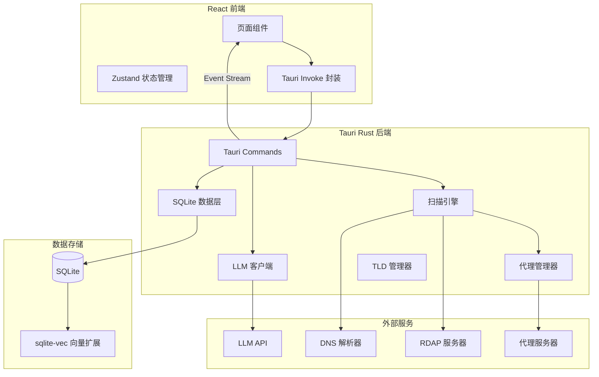

## 产品概述

一个基于 Tauri 框架的桌面应用，用于批量扫描未注册域名。支持 LLM 生成扫描列表、正则/通配符扫描、代理并发请求、任务断点续传、实时日志查看、结果导出、以及基于向量数据库的二次语义筛选。

## 核心功能

- **扫描列表生成**：通过接入预定义或 OpenAI 兼容格式的 LLM API 生成候选域名列表，或使用正则表达式/通配符手动生成，自动组合所有可用 TLD 后缀
- **并发域名扫描**：支持 HTTP/HTTPS/SOCKS5 代理，并发查询域名注册状态（RDAP + DNS 兜底），输出未注册域名结果
- **任务管理**：任务列表展示（进行中/暂停/完成），支持断点续传（记录已完成域名索引，暂停后从断点继续）
- **实时日志**：扫描过程中实时查看任务执行日志，前端通过 Tauri event stream 推送
- **结果导出**：支持导出扫描结果到 JSON/TXT/CSV 格式
- **二次筛选**：将结果导入 SQLite + sqlite-vec 向量数据库，支持精确匹配/模糊匹配/正则匹配/LLM 语义筛选

## 技术栈

- **桌面框架**：Tauri 2.0（Rust 后端 + Web 前端）
- **前端**：React 18 + TypeScript + Vite + Ant Design 5.x + Zustand
- **Rust 后端**：tokio（异步并发）、reqwest（HTTP/代理请求）、rusqlite（SQLite）、serde（序列化）
- **域名查询**：rdap-client（RDAP 协议）+ trust-dns-resolver（DNS 兜底）
- **关系数据库**：SQLite（rusqlite，存储任务、结果、日志）
- **向量数据库**：sqlite-vec（SQLite 向量扩展，零额外部署）
- **LLM 集成**：OpenAI 兼容格式 API（覆盖 glm/minimax/zhipu 等国内厂商）
- **TLD 数据**：ICANN 官方 TLD 列表（内置 + 可更新）

## 实现方案

### 系统架构



### 核心设计决策

**1. 域名注册状态查询策略**

- 优先使用 RDAP（Registration Data Access Protocol，现代 WHOIS 协议），结构化返回、标准化接口
- DNS 解析作为兜底：若域名无 DNS 记录且 RDAP 不可用，标记为"可能未注册"
- 结果中记录查询方法（rdap/dns），便于用户判断可信度

**2. 断点续传机制**

- 每个任务维护 `completed_index`（已完成扫描的域名索引位置）和 `checked_domains`（已检查域名集合）
- 暂停时将当前进度写入 SQLite
- 恢复时从 `completed_index` 位置继续，跳过已检查域名
- 任务状态机：Pending → Running ⇄ Paused → Completed

**3. 并发控制**

- tokio Semaphore 控制最大并发数（用户可配置，默认 50）
- 请求间随机延迟（可配置），避免触发速率限制
- 代理轮转：多代理列表中循环分配请求

**4. LLM 集成**

- 统一 OpenAI 兼容格式，不同厂商只需配置 base_url + api_key
- 预定义模板：GLM/MiniMax/Zhipu 等内置配置
- 两种场景：生成扫描列表（chat completion）、语义筛选（embedding + chat scoring）

**5. 向量语义筛选**

- 使用 LLM embedding API 生成域名向量，存入 sqlite-vec
- 语义筛选流程：用户输入筛选描述 → 生成 embedding → sqlite-vec 相似度搜索 → 返回匹配域名
- 与精确/模糊/正则筛选统一在筛选面板中

**6. 实时日志推送**

- Rust 侧扫描过程通过 Tauri event system 推送日志
- 前端通过 `listen` 监听事件，实时更新日志面板
- 日志同时写入 SQLite task_logs 表，支持历史查看

### 数据库 Schema

```sql
-- 任务表
CREATE TABLE tasks (
    id TEXT PRIMARY KEY,
    name TEXT NOT NULL,
    status TEXT NOT NULL DEFAULT 'pending', -- pending/running/paused/completed
    scan_mode TEXT NOT NULL, -- llm/regex/wildcard/manual
    config_json TEXT NOT NULL, -- 扫描配置 JSON
    total_count INTEGER DEFAULT 0,
    completed_count INTEGER DEFAULT 0,
    created_at DATETIME DEFAULT CURRENT_TIMESTAMP,
    updated_at DATETIME DEFAULT CURRENT_TIMESTAMP
);

-- 域名生成列表（断点续传核心）
CREATE TABLE scan_items (
    id INTEGER PRIMARY KEY AUTOINCREMENT,
    task_id TEXT NOT NULL REFERENCES tasks(id),
    domain TEXT NOT NULL,
    tld TEXT NOT NULL,
    item_index INTEGER NOT NULL, -- 顺序索引，断点续传依据
    status TEXT DEFAULT 'pending', -- pending/checking/available/unavailable/error
    is_available INTEGER, -- 0/1/null
    query_method TEXT, -- rdap/dns
    response_time_ms INTEGER,
    error_message TEXT,
    checked_at DATETIME,
    UNIQUE(task_id, domain)
);

-- 任务日志
CREATE TABLE task_logs (
    id INTEGER PRIMARY KEY AUTOINCREMENT,
    task_id TEXT NOT NULL REFERENCES tasks(id),
    level TEXT NOT NULL DEFAULT 'info', -- info/warn/error/debug
    message TEXT NOT NULL,
    created_at DATETIME DEFAULT CURRENT_TIMESTAMP
);

-- 代理配置
CREATE TABLE proxies (
    id INTEGER PRIMARY KEY AUTOINCREMENT,
    name TEXT,
    url TEXT NOT NULL, -- http://host:port / socks5://host:port
    proxy_type TEXT NOT NULL, -- http/https/socks5
    username TEXT,
    password TEXT,
    is_active INTEGER DEFAULT 1
);

-- LLM 配置
CREATE TABLE llm_configs (
    id TEXT PRIMARY KEY,
    name TEXT NOT NULL, -- GLM/MiniMax/Zhipu/Custom
    base_url TEXT NOT NULL,
    api_key TEXT NOT NULL,
    model TEXT NOT NULL,
    is_default INTEGER DEFAULT 0
);

-- 筛选结果
CREATE TABLE filtered_results (
    id INTEGER PRIMARY KEY AUTOINCREMENT,
    task_id TEXT NOT NULL REFERENCES tasks(id),
    domain TEXT NOT NULL,
    filter_type TEXT NOT NULL, -- exact/fuzzy/regex/semantic
    filter_pattern TEXT,
    is_matched INTEGER NOT NULL,
    score REAL, -- 语义匹配分数
    embedding BLOB -- sqlite-vec 向量数据
);
```

### 目录结构

```
domain-scanner-app/
├── src-tauri/                          # Rust 后端
│   ├── Cargo.toml                      # [NEW] Rust 依赖配置
│   ├── tauri.conf.json                 # [NEW] Tauri 应用配置
│   ├── build.rs                        # [NEW] Tauri 构建脚本
│   ├── capabilities/                   # [NEW] Tauri 2.0 权限配置
│   │   └── default.json
│   ├── src/
│   │   ├── main.rs                     # [NEW] 入口：启动 Tauri 应用
│   │   ├── lib.rs                      # [NEW] 模块声明 + Tauri command 注册
│   │   ├── models/
│   │   │   ├── mod.rs                  # [NEW] 模型模块声明
│   │   │   ├── task.rs                 # [NEW] 任务数据模型（Task, TaskStatus, ScanMode）
│   │   │   ├── scan_item.rs            # [NEW] 扫描项模型（ScanItem, ScanStatus）
│   │   │   ├── proxy.rs                # [NEW] 代理模型（ProxyConfig, ProxyType）
│   │   │   └── llm.rs                  # [NEW] LLM 配置模型（LlmConfig, LlmProvider）
│   │   ├── db/
│   │   │   ├── mod.rs                  # [NEW] 数据库模块声明
│   │   │   ├── init.rs                 # [NEW] 数据库初始化 + 迁移（建表语句）
│   │   │   ├── task_repo.rs            # [NEW] 任务 CRUD + 进度更新
│   │   │   ├── scan_item_repo.rs       # [NEW] 扫描项 CRUD + 断点查询
│   │   │   ├── log_repo.rs             # [NEW] 日志写入 + 分页查询
│   │   │   └── filter_repo.rs          # [NEW] 筛选结果 CRUD + 向量搜索
│   │   ├── commands/
│   │   │   ├── mod.rs                  # [NEW] Command 模块声明
│   │   │   ├── task_cmds.rs            # [NEW] 任务管理 commands（create/start/pause/resume/delete/list）
│   │   │   ├── scan_cmds.rs            # [NEW] 扫描配置 commands（generate_list/preview_tlds）
│   │   │   ├── export_cmds.rs          # [NEW] 导出 commands（export_json/txt/csv）
│   │   │   ├── filter_cmds.rs          # [NEW] 筛选 commands（exact/fuzzy/regex/semantic）
│   │   │   ├── proxy_cmds.rs           # [NEW] 代理管理 commands（CRUD）
│   │   │   ├── llm_cmds.rs             # [NEW] LLM 配置 commands（CRUD + test_connection）
│   │   │   └── log_cmds.rs             # [NEW] 日志查询 commands
│   │   ├── scanner/
│   │   │   ├── mod.rs                  # [NEW] 扫描引擎模块声明
│   │   │   ├── engine.rs               # [NEW] 扫描引擎核心（任务调度、并发控制、断点续传）
│   │   │   ├── domain_checker.rs       # [NEW] 域名注册状态查询（RDAP + DNS）
│   │   │   ├── tld_manager.rs          # [NEW] TLD 列表管理（内置 + 更新）
│   │   │   └── list_generator.rs       # [NEW] 扫描列表生成（正则/通配符/LLM/手动）
│   │   ├── llm/
│   │   │   ├── mod.rs                  # [NEW] LLM 模块声明
│   │   │   ├── client.rs               # [NEW] OpenAI 兼容客户端（chat + embedding）
│   │   │   ├── providers.rs            # [NEW] 预定义厂商配置（GLM/MiniMax/Zhipu）
│   │   │   └── prompts.rs              # [NEW] Prompt 模板（域名生成 + 语义筛选）
│   │   ├── proxy/
│   │   │   ├── mod.rs                  # [NEW] 代理模块声明
│   │   │   └── manager.rs              # [NEW] 代理管理器（轮转、健康检查）
│   │   └── export/
│   │       ├── mod.rs                  # [NEW] 导出模块声明
│   │       └── exporter.rs             # [NEW] 导出器（JSON/CSV/TXT 格式化 + 文件写入）
├── src/                                # React 前端
│   ├── main.tsx                        # [NEW] React 入口
│   ├── App.tsx                         # [NEW] 应用根组件 + 路由
│   ├── vite-env.d.ts                   # [NEW] Vite 类型声明
│   ├── assets/
│   │   └── styles/
│   │       └── global.css              # [NEW] 全局样式
│   ├── types/
│   │   └── index.ts                    # [NEW] TypeScript 类型定义（Task, ScanItem, Proxy, LlmConfig 等）
│   ├── services/
│   │   └── tauri.ts                    # [NEW] Tauri invoke/listen 封装层
│   ├── store/
│   │   ├── taskStore.ts                # [NEW] 任务状态管理（Zustand）
│   │   ├── proxyStore.ts               # [NEW] 代理配置状态
│   │   └── llmStore.ts                 # [NEW] LLM 配置状态
│   ├── hooks/
│   │   ├── useTaskEvents.ts            # [NEW] Tauri event 监听 hook（日志/进度推送）
│   │   └── useTaskLogs.ts              # [NEW] 实时日志 hook
│   ├── pages/
│   │   ├── Dashboard.tsx               # [NEW] 仪表盘首页（任务概览 + 快捷操作）
│   │   ├── TaskList.tsx                # [NEW] 任务列表页（状态筛选 + 批量操作）
│   │   ├── TaskDetail.tsx              # [NEW] 任务详情页（进度/结果/日志/导出）
│   │   ├── NewTask.tsx                 # [NEW] 新建任务页（扫描配置 + LLM/正则/通配符模式）
│   │   ├── FilterResults.tsx           # [NEW] 二次筛选页（精确/模糊/正则/语义筛选）
│   │   ├── ProxyManager.tsx            # [NEW] 代理管理页
│   │   └── Settings.tsx                # [NEW] 设置页（LLM 配置 + TLD 更新 + 通用设置）
│   └── components/
│       ├── Layout/
│       │   ├── AppLayout.tsx           # [NEW] 应用布局（侧边栏 + 内容区）
│       │   └── Sidebar.tsx             # [NEW] 侧边导航栏
│       ├── TaskList/
│       │   ├── TaskCard.tsx            # [NEW] 任务卡片（状态 + 进度条）
│       │   └── TaskStatusBadge.tsx     # [NEW] 任务状态标签
│       ├── ScanConfig/
│       │   ├── LlmScanForm.tsx         # [NEW] LLM 扫描模式配置表单
│       │   ├── RegexScanForm.tsx       # [NEW] 正则/通配符扫描配置表单
│       │   ├── ManualScanForm.tsx      # [NEW] 手动列表输入表单
│       │   └── TldSelector.tsx         # [NEW] TLD 后缀选择器
│       ├── LogViewer/
│       │   └── LogViewer.tsx           # [NEW] 实时日志查看器（虚拟滚动 + 级别筛选）
│       ├── ResultExport/
│       │   └── ExportButton.tsx        # [NEW] 导出按钮（JSON/CSV/TXT 格式选择）
│       └── FilterPanel/
│           ├── ExactFilter.tsx         # [NEW] 精确匹配筛选
│           ├── FuzzyFilter.tsx         # [NEW] 模糊匹配筛选
│           ├── RegexFilter.tsx         # [NEW] 正则匹配筛选
│           └── SemanticFilter.tsx      # [NEW] LLM 语义筛选
├── package.json                        # [NEW] Node.js 依赖配置
├── vite.config.ts                      # [NEW] Vite 配置（Tauri 集成）
├── tsconfig.json                       # [NEW] TypeScript 配置
├── tsconfig.node.json                  # [NEW] Node TypeScript 配置
├── index.html                          # [NEW] HTML 入口
└── .gitignore                          # [NEW] Git 忽略配置
```

## 实现要点

### 性能考量

- **并发扫描**：tokio::sync::Semaphore 控制并发上限，默认 50，用户可调；避免无限制并发导致系统资源耗尽或被目标服务器封禁
- **日志流控**：高频日志通过 Tauri event 批量推送（每 100ms 或积累 50 条），避免前端事件队列过载
- **大列表渲染**：日志查看器和结果列表使用虚拟滚动（react-window），避免大量 DOM 节点
- **数据库写入**：扫描结果批量 INSERT（每 100 条一批），减少事务开销

### 向量数据库集成

- sqlite-vec 以 Rust FFI 方式加载为 SQLite 扩展，与 rusqlite 共享同一数据库连接
- embedding 向量通过 LLM embedding API 生成，存储为 BLOB 类型
- 语义筛选时，先通过 sqlite-vec 近似搜索缩小范围，再通过 LLM chat scoring 精确评估

### 错误处理与可靠性

- RDAP/DNS 查询超时设置（默认 10s），超时标记为 error，不阻塞后续扫描
- 代理连接失败自动切换到下一个可用代理
- LLM API 调用失败时降级为纯本地模式（正则/通配符仍可用）
- SQLite WAL 模式，避免并发读写锁冲突

### 一次性安装依赖

- Rust 依赖通过 Cargo.toml 声明，`cargo build` 时自动下载
- Node.js 依赖通过 package.json 声明，`npm install` 时自动安装
- sqlite-vec 通过 Cargo feature 编译为 Rust 侧 SQLite 扩展，无需用户手动安装

## 设计风格

采用深色科技风（Dark Cyberpunk）设计风格，契合域名扫描工具的技术定位。深色背景搭配青绿色/琥珀色强调色，营造专业且现代的工具感。玻璃拟态（Glassmorphism）面板设计，半透明卡片配合模糊背景，层次分明。

## 页面规划

### 1. 仪表盘首页（Dashboard）

- **顶部统计栏**：运行中任务数/已完成/可用域名总数/代理状态，四格统计卡片
- **最近任务列表**：最近 5 个任务卡片，显示名称/状态/进度条/操作按钮
- **快捷操作区**：新建扫描任务/管理代理/查看结果 快捷入口按钮

### 2. 任务列表页（TaskList）

- **筛选工具栏**：状态 Tab 筛选（全部/进行中/暂停/完成）+ 搜索框
- **任务卡片网格**：每个卡片展示任务名/扫描模式/进度/状态/创建时间/操作按钮（暂停/继续/详情/删除）
- **批量操作栏**：全选 + 批量删除/导出

### 3. 新建任务页（NewTask）

- **模式选择区**：LLM 生成/正则通配符/手动输入 三种模式 Tab 切换
- **配置表单区**：根据模式动态展示对应配置（LLM 选择 + prompt/正则表达式/域名列表 + TLD 选择）
- **代理与并发配置**：代理选择/并发数/请求间隔
- **预览与提交**：预览生成的域名列表数量 + 开始扫描按钮

### 4. 任务详情页（TaskDetail）

- **进度头部**：进度环形图 + 状态标签 + 统计数据（总数/已查/可用/不可用/错误）
- **结果表格区**：域名/TLD/状态/查询方法/响应时间，支持排序和筛选
- **实时日志区**：底部可折叠日志面板，带级别筛选和自动滚动
- **操作工具栏**：暂停/继续/导出/导入筛选

### 5. 二次筛选页（FilterResults）

- **筛选模式切换**：精确匹配/模糊匹配/正则匹配/语义筛选 Tab
- **筛选输入区**：根据模式展示输入框（文本/正则/语义描述）
- **结果展示区**：筛选结果表格，显示域名/匹配分数/匹配方式
- **批量操作**：导出筛选结果/重新筛选

### 6. 设置页（Settings）

- **LLM 配置区**：预定义厂商快速添加 + 自定义 API 配置（base_url/api_key/model）
- **代理管理区**：代理列表 CRUD + 连接测试
- **TLD 管理区**：当前 TLD 列表 + 更新按钮
- **通用设置**：默认并发数/超时时间/日志级别

## Agent Extensions

### Skill

- **frontend-design**
- Purpose: 创建高质量的前端 UI 界面，包括仪表盘、任务列表、扫描配置、日志查看器、筛选面板等核心页面
- Expected outcome: 生成具有深色科技风格、玻璃拟态效果的专业级 React 组件代码，视觉效果令人印象深刻