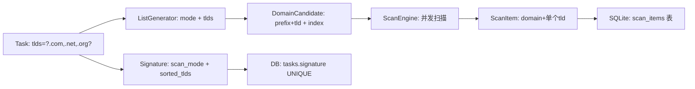

## 用户需求

将当前"1 Task = n 前缀 × 1 TLD"的原子任务模型改为"1 Task = n 前缀 × m TLD"，支持多前缀与多后缀的笛卡尔积扫描。

## 产品概述

一个任务即可同时扫描多个前缀和多个 TLD 后缀的笛卡尔积组合。例如：3 个前缀 × 4 个 TLD = 12 种组合全部在一个任务中完成。任务签名基于"前缀模式 + sorted(TLDs)"生成，确保相同组合不重复创建。ListGenerator 改为流式生成前缀×TLD 笛卡尔积。前端新建任务页面选择多 TLD 后只创建 1 个任务而非多个独立任务。

## 核心功能

- **Task 模型**：`tld: String` → `tlds: Vec<String>`（DB 中存为 JSON 数组字符串）
- **签名去重**：基于 sorted(tlds) 保证 TLD 顺序无关性
- **ListGenerator**：支持多 TLD 笛卡尔积生成，每个前缀与每个 TLD 组合
- **前端展示**：多 TLD 以标签组形式展示，新建任务选择多 TLD 后只创建 1 个任务
- **兼容性**：ScanItem 保留单个 tld 字段（每条扫描结果属于一个具体 TLD）

## Tech Stack

沿用现有技术栈：Tauri 2.0 + Rust + React 18 + TypeScript + TailwindCSS + SQLite

## Implementation Approach

### 核心设计决策

1. **Task.tlds 存储**：Rust 侧 `tlds: Vec<String>`，DB 中 `tlds TEXT NOT NULL` 存储 JSON 数组字符串（如 `["com","net","org"]`）。用 JSON 而非逗号分隔，避免解析歧义。
2. **签名生成**：`generate_signature(scan_mode, tlds: &[String])`，内部将 tlds 排序后拼接，保证 `{.com,.net}` 和 `{.net,.com}` 生成相同签名。
3. **ListGenerator 笛卡尔积**：`new(mode, tlds: Vec<String>)`，生成候选时每个 prefix 与每个 tld 组合，index 按 `(prefix_idx * tld_count + tld_idx)` 线性编码，支持断点续传。
4. **CreateTasksRequest 简化**：多 TLD 不再循环创建多任务，直接创建 1 个 Task。batch 仅在用户显式创建多个不同任务时使用。
5. **ScanItem 不变**：每条扫描结果仍记录单个 tld，因为查询域名注册状态是针对 `prefix.tld` 这个完整域名的。

### 性能考虑

- ListGenerator 的笛卡尔积不需要预分配内存：prefix 按需生成 + tlds 遍历 = 流式输出
- total_count = prefix_count × tld_count，可能较大但 index 编码是 O(1) 计算
- 签名排序开销：tlds 数量通常 < 20，排序可忽略

## Implementation Notes

- DB 迁移：`tld TEXT NOT NULL` → `tlds TEXT NOT NULL`，需要删旧表重建（项目尚在开发期，无生产数据）
- row_to_task 中 tlds 字段需要 `serde_json::from_str` 反序列化
- task_repo 的 `batch_create` 中 `skipped_tlds` 改为 `skipped_signatures` 更准确
- 前端 NewTask 页面：多 TLD 选择后预估量 = 单TLD预估量 × TLD数量
- 前端 TaskList/TaskDetail 中 tld 单标签改为 tlds 多标签展示

## Architecture Design



## Directory Structure

```
domain-scanner-app/
├── src-tauri/
│   ├── src/
│   │   ├── models/
│   │   │   └── task.rs                 # [MODIFY] Task.tld→tlds:Vec<String>, 签名/序列化适配
│   │   ├── db/
│   │   │   ├── init.rs                 # [MODIFY] tasks 表 tld→tlds TEXT, 索引适配
│   │   │   └── task_repo.rs            # [MODIFY] row_to_task 适配 tlds JSON, batch_create 适配
│   │   ├── scanner/
│   │   │   ├── list_generator.rs       # [MODIFY] new(mode,tlds), 笛卡尔积生成, index编码
│   │   │   └── signature.rs            # [MODIFY] generate_signature(mode,tlds:&[String])
│   │   ├── commands/
│   │   │   ├── task_cmds.rs            # [MODIFY] CreateTasksRequest→单任务, 去掉多TLD循环
│   │   │   ├── scan_cmds.rs            # [MODIFY] ScanPreviewRequest.tld→tlds, 多TLD预览
│   │   │   └── export_cmds.rs          # [MODIFY] 无大改，ScanItem已有tld
│   │   └── export/
│   │       └── exporter.rs             # [MODIFY] 无大改，ScanItem已有tld
│   └── tests/
│       └── integration_tests.rs        # [MODIFY] 所有 Task 构造适配 tlds
├── src/
│   ├── types/
│   │   └── index.ts                    # [MODIFY] Task.tld→tlds:string[], BatchCreateResult适配
│   ├── pages/
│   │   ├── NewTask.tsx                 # [MODIFY] 多TLD→1任务, 预估=单TLD×TLD数
│   │   ├── Dashboard.tsx               # [MODIFY] 任务卡片显示多TLD标签
│   │   ├── TaskList.tsx                # [MODIFY] 任务卡片显示多TLD标签
│   │   └── TaskDetail.tsx              # [MODIFY] 详情页显示多TLD标签
│   └── store/
│       └── taskStore.ts                # [MODIFY] createTasks 参数适配
```

UI 调整范围较小，主要是在已有页面上将单 TLD 标签改为多 TLD 标签组展示。保持现有深色科技风设计不变。

### 多 TLD 标签展示规范

- 任务卡片中：原来显示单个 `.com` 标签，改为显示多个小标签（如 `.com` `.net` `.org`），使用 `flex flex-wrap gap-1` 布局
- 标签样式：延续现有 `text-xs text-cyber-muted px-1.5 py-0.5 rounded bg-cyber-surface` 样式
- 超过 3 个 TLD 时：显示前 3 个 + "+N" 计数标签
- NewTask 页面：预估量显示改为"预估总数 = 单TLD数 × TLD数"，去掉"将为每个 TLD 创建独立任务"提示

### 修改的页面区块

1. **NewTask**：TLD 选择区下方提示改为"1 个任务覆盖 N 个 TLD"，提交区显示"将创建 1 个任务"
2. **Dashboard**：最近任务卡片 TLD 标签改为多标签组
3. **TaskList**：任务行 TLD 标签改为多标签组
4. **TaskDetail**：标题从"4字母 .com 扫描"改为"4字母 [.com .net .org] 扫描"

## SubAgent

- **code-explorer**
- Purpose: 修改过程中搜索验证模块间调用链，确保 signature/list_generator/task_repo/commands 之间的接口变更一致
- Expected outcome: 准确定位所有引用 tld 字段的调用点，确保无遗漏