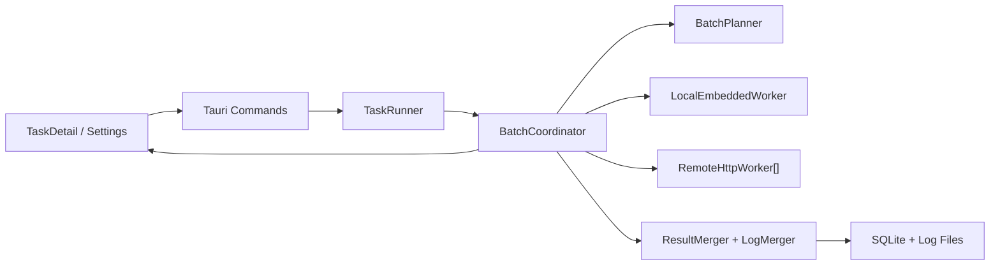

# 架构设计

## 当前相关模块

当前扫描链路主要由以下模块组成：

- `src-tauri/src/scanner/task_runner.rs`: 任务生命周期和后台运行。
- `src-tauri/src/scanner/engine.rs`: 完整任务扫描引擎。
- `src-tauri/src/scanner/list_generator.rs`: 候选域名生成。
- `src-tauri/src/scanner/domain_checker.rs`: RDAP/DNS 请求。
- `src-tauri/src/db/scan_item_repo.rs`: 扫描结果持久化。
- `src-tauri/src/db/log_repo.rs`: 任务和请求日志。
- `src/pages/TaskDetail.tsx`: 任务详情、进度、日志和结果视图。

## 目标架构



## 新增后端模块

建议新增：

```text
src-tauri/src/scanner/batch.rs
src-tauri/src/scanner/batch_planner.rs
src-tauri/src/scanner/batch_executor.rs
src-tauri/src/scanner/batch_coordinator.rs
src-tauri/src/scanner/local_worker.rs
src-tauri/src/scanner/remote_worker.rs
src-tauri/src/db/scan_batch_repo.rs
src-tauri/src/db/cluster_worker_repo.rs
src-tauri/src/commands/worker_cmds.rs
```

## BatchWorker 抽象

本地 worker 和远端 worker 使用同一抽象：

```rust
trait BatchWorker {
    async fn submit_batch(&self, plan: BatchPlan) -> Result<BatchSubmitAck, String>;
    async fn get_status(&self, batch_id: &str) -> Result<BatchStatusSnapshot, String>;
    async fn get_results(&self, batch_id: &str, after_seq: i64, limit: usize) -> Result<BatchResultPage, String>;
    async fn get_logs(&self, batch_id: &str, after_seq: i64, limit: usize) -> Result<BatchLogPage, String>;
    async fn pause_batch(&self, batch_id: &str) -> Result<(), String>;
    async fn cancel_batch(&self, batch_id: &str) -> Result<(), String>;
}
```

## 本地执行路径

```text
TaskRunner
  -> BatchCoordinator
  -> LocalEmbeddedWorker
  -> BatchExecutor
  -> DomainChecker
  -> ResultMerger
  -> scan_items/log files
```

本地执行必须先完成，作为远端 worker 接入前的兼容基础。

## 远端执行路径

```text
TaskRunner
  -> BatchCoordinator
  -> RemoteHttpWorker
  -> Docker worker API
  -> polling status/results/logs
  -> ResultMerger
  -> scan_items/log files
```

## 前端视图

任务详情主视图保持：

- 一个进度。
- 一个结果表。
- 一个日志面板。
- 一个运行记录列表。

可新增折叠区域展示：

- worker 数量。
- batch 总数。
- running/completed/failed/retrying batch 数量。
- 当前总并发。
- 异常 worker 摘要。

## 状态聚合

batch 状态：

```text
queued / assigned / running / succeeded / failed / retrying / paused / cancelled / expired
```

任务状态仍保持：

```text
pending / running / paused / stopped / completed
```

聚合规则：

- 全部 batch succeeded -> task completed。
- 有 batch queued/assigned/running/retrying -> task running。
- 用户暂停且无 running batch -> task paused。
- 用户停止 -> task stopped。
- batch 重试耗尽 -> task paused，并记录原因。
